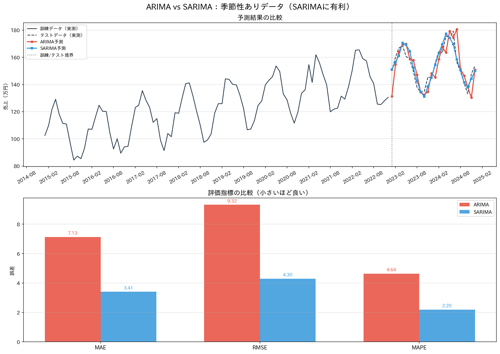
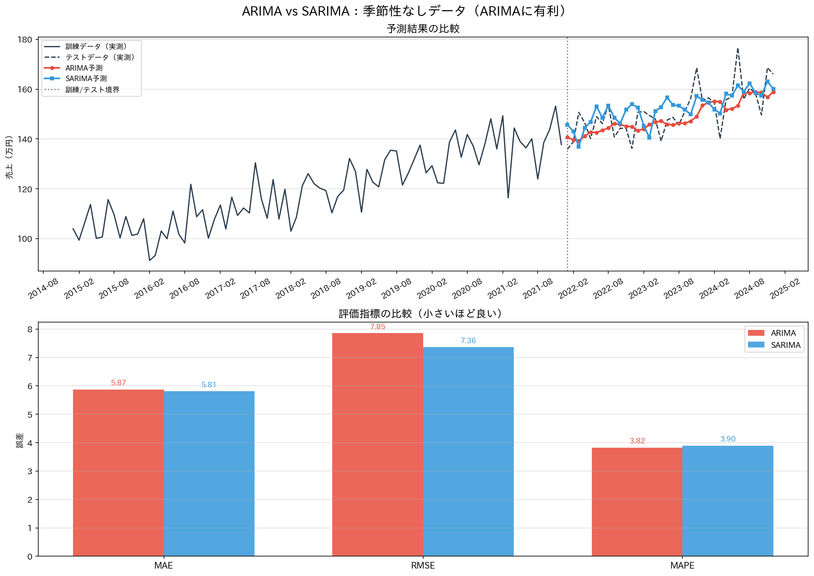

# ARIMA SARIMA Comparison

## 概要
ARIMAモデルとSARIMAモデルの性能を比較し、時系列データ分析におけるモデル選択を実践的に学ぶためのプロジェクトです。  
AIエンジニアを目指すにあたり、時系列データの基本的な特性である季節性の有無が、予測モデルの精度にどう影響するかを深く理解するために開発しました。合成データを用いることで、各モデルが有利となる条件を明確にし、評価指標と可視化を通じてその違いを明らかにします。

## 実行結果
季節性ありデータ


季節性なしデータ


## 主な機能
- トレンドと季節性を持つデータと、トレンドのみを持つデータの2種類の合成時系列データを自動生成
- statsmodelsライブラリを使用し、時系列データの定常性を確認するためのADF（拡張ディッキー–フラー）検定を実装
- ARIMAモデルとSARIMAモデルを構築し、時系列データの未来予測を実行
- ローリング予測（ウォークフォワード検証）を実装し、1ステップずつ実績値でモデルを更新する、より実践的な評価プロセスを採用
- MAE（平均絶対誤差）、RMSE（二乗平均平方根誤差）、MAPE（平均絶対パーセント誤差）の3つの指標でモデルの予測精度を定量的に評価
- 予測結果と評価指標をMatplotlibでグラフ化し、両モデルのパフォーマンスの違いを直感的に比較
- 分析結果のグラフを画像ファイルとして自動で保存

## 使用技術
・言語
  Python
・ライブラリ
  pandas
  numpy
  statsmodels
  scikit-learn
  matplotlib

## 導入・実行方法
### 1. リポジトリをクローン
```bash
git clone https://github.com/N-Ritsu/AIstudy.git
cd AIstudy/arima_sarima_comparison
```
### 2. Conda仮想環境の構築と有効化
```bash
conda create --name arima_sarima_comparison_env python=3.10 -y
conda activate arima_sarima_comparison_env
```
### 3. 必要なライブラリをインストール
```bash
pip install -r requirements.txt
```
### 4 . プログラムを実行
```bash
python arima_sarima_comparison.py
```
実行すると、comparison_seasonal.pngとcomparison_no_seasonal.pngが生成されます。

## 開発を通して
私はこのarima_sarima_comparisonの開発が、季節性のある時系列データを分析する初めての経験となりました。  
中でも意外だったのが、季節性のあるデータに対しSARIMAが有意なのに対し、季節性のないデータに関してはARIMAとSARIMAの間に大きな差がなかった点です。このことから、SARIMAはARIMAに季節性の概念を与えたが、それに引っ張られるように季節性のないデータに対する精度が犠牲になっているわけではないことがわかり、SARIMAの優位性について実感しました。  
しかし、ARIMAの長所として、実行にかかる時間が圧倒的に短いことが分かりました。そのため、季節性のないデータについてはARIMAを使う方が、精度を落とさずに実行速度を上げることができるため、SARIMAがARIMAの完全な上位互換ではないということが分かりました。  
このことから、ARIMAとSARIMAの使い分けについても理解を深めることができました。