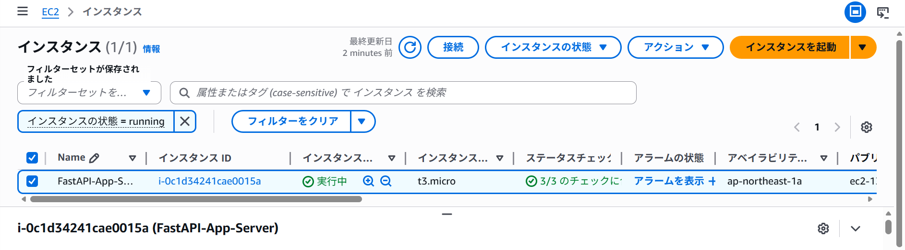

# AWS Infrastructure Construction from Terraform

## 概要
FastAPIアプリケーションをコンテナ化し、そのインフラ構築からデプロイまでをTerraformとGitHub Actionsを用いて自動化するプロジェクトです。  
AIに強いアプリケーションエンジニアを目指すにあたり、学習したAIモデルをAPIとして提供し、それを安定稼働させるためのモダンなクラウドインフラの構築・運用スキルを習得するために開発しました。Infrastructure as Code (IaC) の実践と、CI/CDパイプラインによるデプロイ自動化の実現を目的としています。

## 実行結果


## 主な機能
- FastAPIアプリケーション: "Hello, World"を返すシンプルなAPIを実装。
- Docker: FastAPIアプリケーションをコンテナイメージとしてパッケージング。
- Terraform (Infrastructure as Code): AWS上に必要なインフラストラクチャをコードで定義。
  - ECR: Dockerイメージを保存するためのプライベートコンテナリポジトリ。
  - EC2: コンテナ化されたアプリケーションを実行するための仮想サーバー。
  - IAM: EC2インスタンスがECRからイメージをプルするための適切な権限管理。
  - Security Group: 外部からのHTTPアクセスを許可するファイアウォール設定。
- GitHub Actions (CI/CD): 以下のプロセスを自動化。
  - mainブランチへのプッシュをトリガー。
  - アプリケーションのDockerイメージをビルド。
  - ビルドしたイメージをAWS ECRにプッシュ。
  - Terraformを実行し、AWSインフラを構築または更新。
  - EC2インスタンスが起動時に最新のDockerイメージをプルしてサービスを開始。

## 使用技術
・言語
  Python
・フレームワーク
  FastAPI
・サーバー
  Uvicorn
・クラウド
  AWS
・コンテナ技術
  Docker
・Infrastructure as Code
  Terraform
・CI/CD
  GitHub Actions

## 導入・実行方法
### 0. 前提条件
・AWSアカウントを作成済み
・GitHubリポジトリ作成済み
・以下のGitHub Secretsが設定されている
  ・AWS_ACCESS_KEY_ID: AWSのアクセスキーID
  ・AWS_SECRET_ACCESS_KEY: AWSのシークレットアクセスキー
### 1. リポジトリをクローン
```bash
git clone https://github.com/N-Ritsu/AIstudy.git
cd AIstudy/aws_infrastructure_construction_from_terraform
```
### 2. ECRリポジトリのセットアップ
```bash
cd aws_infrastructure_construction_from_terraform/terraform
export AWS_ACCESS_KEY_ID="YOUR_AWS_ACCESS_KEY_ID"
export AWS_SECRET_ACCESS_KEY="YOUR_AWS_SECRET_ACCESS_KEY"
terraform init
terraform apply
```
### 3. 自動デプロイの実行
初回セットアップ完了後、リポジトリのmainブランチに何かしらの変更をプッシュすると、GitHub Actionsが自動でデプロイを行います。

## 開発を通して
私はこのaws_infrastructure_construction_from_terraformの開発が、初めてのクラウドインフラを含めた本格的なCI/CDパイプラインの構築経験となりました。  
デプロイ時に何度もエラーに遭遇し、AWSとの連携は困難を極めましたが、GitHub Actionsの細やかなエラーログによって原因を突き止めて修正することができました。  
また、AWSのサービスを手動で設定するよりミスが起こりにくい自動化パイプラインの重要性を実感しました。