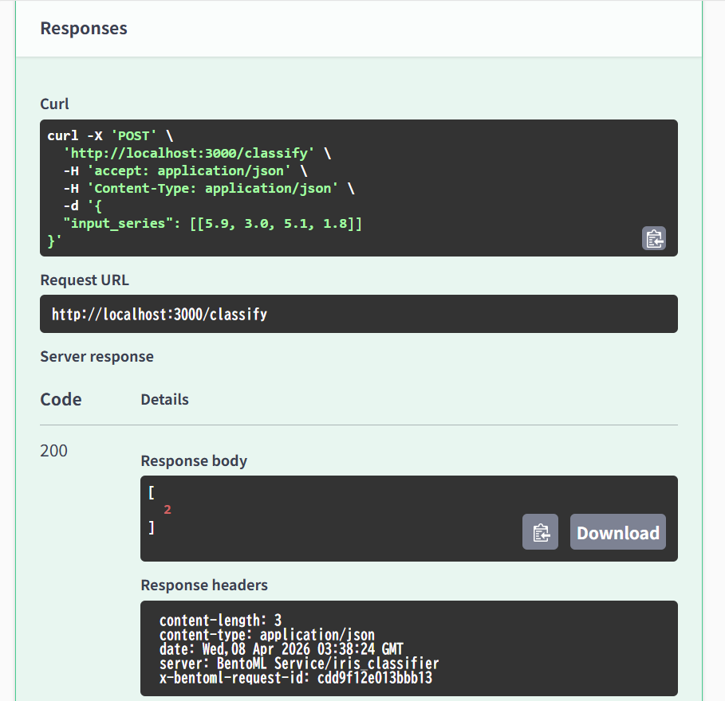

# BentoML SKLearn Serving

## 概要
Scikit-learnで学習させた機械学習モデル（アヤメ分類器）を、BentoMLを用いて高性能なAPIサーバーとして提供し、Docker Hubを通じて配布可能にするプロジェクトです。  
AIに強いアプリケーションエンジニアを目指す上で、MLOpsとして、モデルのパッケージング、コンテナ化、そしてAPIとしての提供という一連のプロセスを深く理解するために開発しました。

## 実行結果


## 主な機能
- Scikit-learnで学習したモデルを、BentoMLの形式でバージョン管理付きで保存
- BentoMLのクラスベースのサービス定義を用い、堅牢でスケーラブルなAPIサーバーを構築
- bentofile.yaml にて、サービス、モデル、Pythonの依存関係を宣言的に定義
- bentoml build コマンドで、アプリケーション全体を自己完結した「Bento」としてパッケージング
- bentoml containerize コマンドで、本番環境向けのDockerコンテナイメージをDockerfileなしで自動生成
- Docker Hubへのプッシュと、そこからのプルによる、環境に依存しないアプリケーションの配布と実行

## 使用技術
・言語
  Python
・ライブラリ
  Scikit-learn
・モデルサービング
  BentoML
・コンテナ技術
  Docker
・コンテナレジストリ
  Docker Hub


## 導入・実行方法
## Dockerイメージを取得し、ブラウザで実行する方法
### 0. 前提
Dockerがインストールされていることを前提とします。
### 1. Docker Hubからイメージを取得
ターミナルを開き、以下のコマンドを実行して、私がDocker Hubに公開したコンテナイメージをダウンロードします。
```bash
docker pull nritsu/iris-classifier:1.0
```
### 2. コンテナとしてAPIサーバーを起動
ダウンロードしたイメージを使って、APIサーバーを起動します。
```bash
docker run -p 3000:3000 nritsu/iris-classifier:1.0
```
### 3. ブラウザで確認
Webブラウザで http://localhost:3000 にアクセスしてください。自動生成されたAPIドキュメント（Swagger UI）が表示され、そこから直接APIをテストできます。

## クライアントスクリプトで実行する方法
### 1. リポジトリをクローン
```bash
git clone https://github.com/N-Ritsu/AIstudy.git
cd AIstudy/bentoml_sklearn_serving
```
### 2. Conda仮想環境の構築と有効化
```bash
conda create --name bentoml_sklearn_serving_env python=3.10 -y
conda activate bentoml_sklearn_serving_env
```
### 3. 必要なライブラリをインストール
```bash
pip install -r requirements.txt
```
### 4 . プログラムを実行
```bash
python requests.py
```

## 開発を通して
私はこのBentoMLプロジェクトの開発が、初めての本格的なモデルサービング経験となりました。  
BentoMLを使うことで、Dockerfileを手書きすることなく本番用のコンテナイメージを生成できる手軽さと、Swagger UIによるAPIを直感的に理解しやすいWebページを表示できることに驚きました。  
bentoml build と bentoml containerize の２つのコマンドだけで、ローカルでの実験コードをサービスとして提供できるようになるという画期的なプロセスに、MLOpsの必要性を強く実感しました。