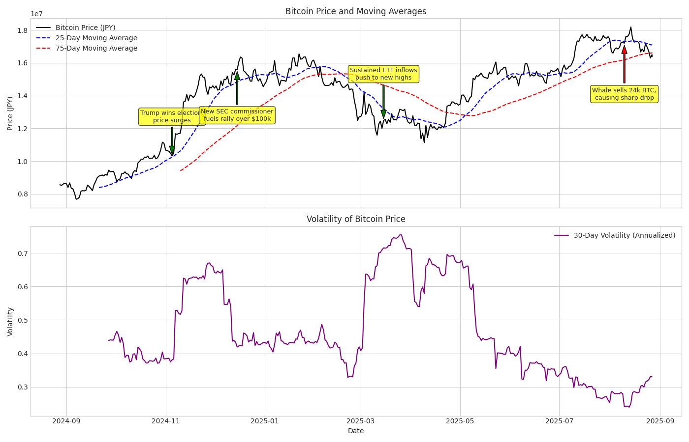

# Bitcoin Crypto Analyzer

## 概要  
公開APIから取得したビットコインの過去の価格データに基づき、市場のトレンドとリスクを分析・可視化するデータ分析ツールです。
AIエンジニアを目指すにあたり、API連携によるデータ収集から、pandasを用いたデータ加工・分析、そしてmatplotlibによる高度な可視化まで、一連のデータサイエンスのワークフローの実装経験を積むために、このプロジェクトを開発しました。

## 実行結果  


## 主な機能  
- リアルタイムデータ取得: CoinGeckoの公開APIにアクセスし、ビットコインの過去365日分の価格データを円建てで取得。
- 時系列データ分析:
  - トレンド分析: 25日間および75日間での移動平均線を算出し、価格トレンドを可視化。
  - リスク分析: 日々の価格変動率から、市場の変動の激しさを示すボラティリティ（30日間移動標準偏差）を計算。
- 2つのグラフを連動させ、価格トレンドとボラティリティを同時に比較可能。
- グラフ上に、市場に大きな影響を与えた実際のニュースイベントを矢印付きで注釈（アノテーション）として表示し、価格変動の文脈を提示。
- 結果のエクスポート: 分析に使用した全データをCSVファイルとして出力。

## 使用技術  
- 言語  
  - Python  
- ライブラリ   
  - requests: CoinGecko APIとのHTTP通信によるデータ取得に利用。
  - pandas: 取得したデータの整形、時系列インデックスの設定、移動平均やボラティリティなどの金融指標計算に利用。
  - matplotlib: 分析結果のグラフ化。複数のグラフのレイアウト、スタイル設定、動的なアノテーション描画に利用。
- 環境管理:
  Conda: データサイエンスライブラリの依存関係を安定して管理するために使用。

## 導入・実行方法  
### 1. リポジトリをクローン  
```bash
git clone https://github.com/N-Ritsu/AIstudy.git  
cd AIstudy/bitcoin_crypto_analyzer
```
### 2.Conda仮想環境の構築と有効化
```bash
conda create --name bitcoin_crypto_analyzer_env python=3.10 -y
conda activate bitcoin_crypto_analyzer_env
```
### 3. 必要なライブラリをインストール
```bash
pip install -r requirements.txt
```
### 4. プログラムを実行
```bash
python bitcoin_crypto_analyzer.py
```
実行が完了すると、プロジェクトフォルダ内に bitcoin_data_analysis.csv と bitcoin_analysis_chart_with_annotation.png が生成されます。

## 開発を通して  
私はこのBitcoin Crypto Analyzerの開発が、初めてのAPIデータ加工・分析、そしてmatplotlibでのグラフ作成の機会となりました。 
開発で最も苦労したのは、matplotlibでのグラフの作成です。  
元々私は、Bitcoinの価格推移についての知識を持っておらず、どんなデータが必要とされているのかを知るところから開発はスタートしました。ただ価格推移だけをグラフ化するのではなく、トレンド分析やリスク分析を行い、かつそれぞれにグラフを用意し比較できるように作成するという発想にいたるまでに時間がかかりました。  
結果として、とてもシンプルかつ可読性のたかいグラフを作成することに成功し、有用なCrypto Analyzerを作成することができました。  
また、ヘルパー関数を用いた、より可読性の高い関数化に挑戦し、リファクタリングスキルを磨くことができました。
