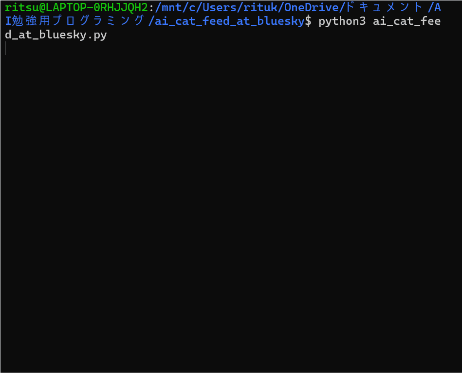

# Bluesky AI Cat Feed

## 概要  
Blueskyのタイムラインから、猫に関する画像を投稿しているものをAIによって判別し、抽出するフィード作成ツールです。  
AIエンジニアを目指すにあたり、API連携や、最新のAIモデルを実践的に活用する経験を積むために、このプロジェクトを開発しました。

## 実行結果  


## 主な機能  
- Blueskyのタイムラインをリアルタイムで20件取得
- 通常投稿、リポスト、引用リポストなど、多様な投稿形式から画像を抽出
- Hugging FaceのVision Transformer (ViT) モデルによる高精度な猫画像判定
- 抽出結果をコンソールに出力

## 使用技術  
・言語  
  Python  
・ライブラリ  
  atproto  
  Hugging Face Transformers  
  Pillow (PIL)  
  requests　　
  python-dotenv  

## 導入・実行方法  
### 1. リポジトリをクローンし、このプロジェクトのディレクトリに移動  
```bash
git clone https://github.com/N-Ritsu/AIstudy.git
cd AIstudy/bluesky_ai_cat_feed  
```
### 2. 必要なライブラリをインストール  
```bash
pip install -r requirements.txt  
```
### 3. 環境変数を設定  
`.env`ファイルを作成し、そのファイル内に自身のBlueskyのハンドルとアプリパスワードを以下のように記述してください。  
```bash
BLUESKY_HANDLE="YOUR_HANDLE.bsky.social"  
BLUESKY_PASSWORD="xxxx-xxxx-xxxx-xxxx"  
```
### 4. プログラムを実行  
```bash
python bluesky_ai_cat_feed.py  
```

## 開発を通して  
私はこのBluesky AI Cat Feedの開発が、初めての独学でのAPI連携とAI技術の組み込み経験となりました。  
開発で最も苦労したのは、AttributeErrorを始めとする多くのエラーを１つ１つ自力でデバッグしていく作業でした。  
この開発を通して、エラーの原因の特定と、それによる堅牢なシステムの作成について腕を磨くことができました。