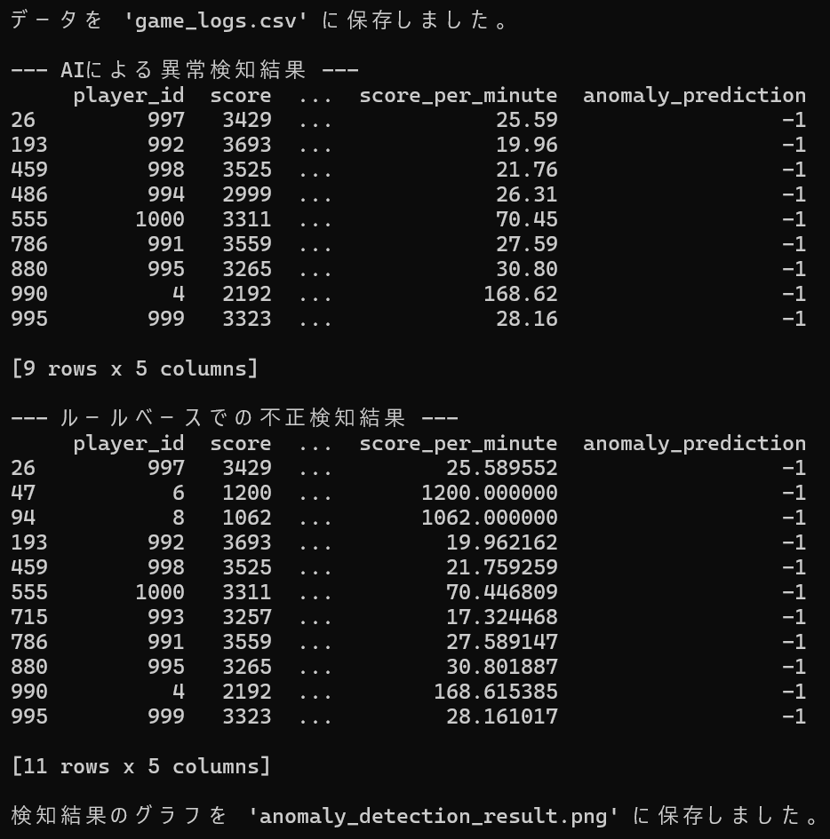
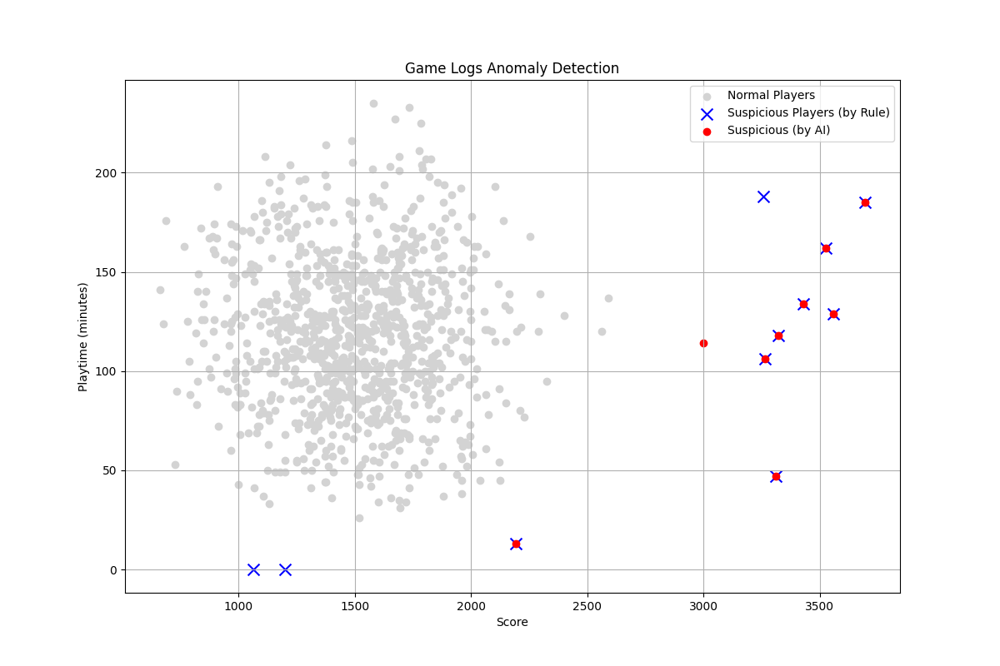

# Cheat Detector

## 概要  
ランダムな数値生成により擬似的に生成したプレイヤーデータから、チートが疑われるデータを検出するプログラムです。  
AIエンジニアを目指すにあたり、AIによる異常値判定の経験を積むために、このプロジェクトを開発しました。

## 実行結果  
  


## 主な機能  
- 1000人分のプレイヤーデータをランダムで生成(一部プレイヤーデータはあえて異常値に設定)し、csvファイルに保存  
- プレイヤーデータのうち異常値とみられるものを、AI(Isolation Forest)によって検出  
- プレイヤーデータのうち異常値とみられるものを、ルールベースで検出  
- 一般プレイヤー、AIによって検出されたチーター、ルールベースで検出されたチーターをそれぞれ散布図にプロットし可視化、グラフとしてpngファイルに保存

## 使用技術  
・言語  
  Python  
・ライブラリ   
  matplotlib  
  numpy  
  pandas  
  scikit-learn

## 導入・実行方法  
### 1. リポジトリをクローン  
```bash
git clone https://github.com/N-Ritsu/AIstudy.git  
cd AIstudy/cheat_detector
```
### 2. 必要なライブラリをインストール
```bash
pip install -r requirements.txt
```
### 3. プログラムを実行
```bash
python cheat_detector.py
```

## 開発を通して  
私はこのCheat Detectorの開発が、初めてのAIを用いた異常値検出経験となりました。  
開発で最も苦労したのは、AIモデルによる検出はあくまで統計的な外れ値の検出であるという特性による、人間の考える異常値との乖離を制御することでした。  
この課題を解決するため、スコアとプレイ時間から"時間効率"という新しい特徴量を設計し、AIの判断材料を改善しました。  
さらに、どうしてもAIが見逃してしまう・誤検知してしまうパターンについては、複数の閾値を組み合わせたルールベースでの異常値検出を用いることで、AIとルールベースそれぞれが互いの欠点を補完しあうハイブリッドな検知システムを作成しました。  
この開発を通して、実践的なAIの異常値検出技術を向上させるとともに、特徴量エンジニアリングの経験を積むことができました。  
また、単にAIに頼るだけでない、ルールベースと組み合わせることでの精度向上についても理解を深めることができました。