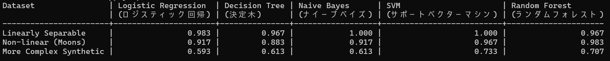
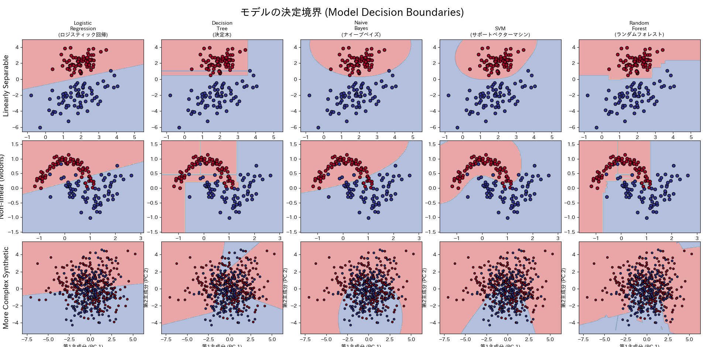
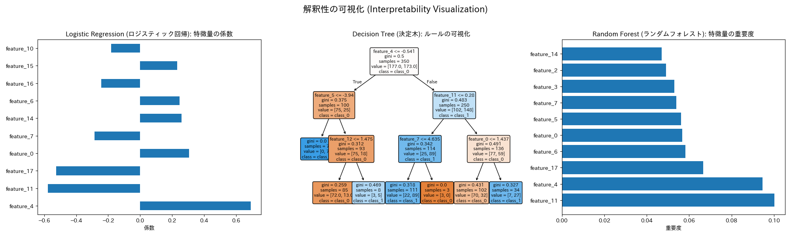

# Classification Model Comparison

## 概要
ロジスティック回帰、決定木、ナイーブベイズ、SVM、ランダムフォレストといった基礎的な機械学習モデルの性能と解釈性を多角的に比較・可視化するプロジェクトです。  
AIエンジニアを目指すにあたり、基礎的な機械学習モデルの得意不得意を深く理解するために開発しました。性質の異なる複数のデータセットを用いることで、各モデルがどのような状況で強みを発揮するのかを実験的に探求します。

## 実行結果
各モデルの性能比較


各モデルの決定境界


各モデルの解釈性の可視化図


## 主な機能
- scikit-learnのデータ生成機能を使用し、性質の異なる3種類のデータセットを自動で生成
- 2次元データに対し、各モデルが描く分類の境界線をプロット
- 主成分分析(PCA)を用い、高次元データを2次元に削減して決定境界の傾向を可視化
- 正解率(Accuracy)を指標とし、各モデルの性能を整形された表形式で出力
- ロジスティック回帰の係数をグラフ化し、各特徴が予測に与える影響（正負と強さ）を分析
- 決定木のルール構造をツリー形式でプロットし、判断プロセスを完全に可視化
- ランダムフォレストの特徴量重要度を算出し、予測に貢献した変数を特定


## 使用技術
・言語
  Python
・ライブラリ
  pandas
  scikit-learn
  matplotlib
  japanize-matplotlib
  numpy
  wcwidth

## 導入・実行方法
### 1. リポジトリをクローン
```bash
git clone https://github.com/N-Ritsu/AIstudy.git
cd AIstudy/classification_model_comparison
```
### 2. Conda仮想環境の構築と有効化
```bash
conda create --name classification_model_comparison_env -y
conda activate classification_model_comparison_env
```
### 3. 必要なライブラリをインストール
```bash
pip install -r requirements.txt
```
### 4 . プログラムを実行
```bash
python classification_model_comparison.py
```


## 開発を通して
私はこのClassification Model Analyzerの開発が、初めて複数の機械学習モデルを多角的に比較・評価した経験となりました。  
この開発を通して学んだ各モデルの特徴をまとめておきます。  

ロジスティック回帰: 一番シンプルで、決定境界・解釈ともに非常に分かりやすいが、線形分離できない複雑なデータに対し精度が低い。線形分離ができそうなデータに対し特効的に有効なイメージ。  
決定木: 複雑なデータに対し、ロジスティック回帰より精度が高いが、決定境界が複雑。しかし、解釈の内容が人間にとって非常に分かりやすい。過学習しやすいという弱点がある。人間が、"なぜその結果になったのか"をしっかり追いたい場合に有効なイメージ。  
ナイーブベイズ: 非線形な分割が可能という特徴がある。決定境界が分かりやすく、複雑なデータにある程度対応できる。最も学習が速いという特徴がある。とにかくたくさんの特徴量を高速に分類したい場合に有効なイメージ。  
サポートベクターマシン: 非線形な分割が可能という特徴がある。決定境界が比較的分かりやすく、複雑なデータに対しても汎用的に精度が高い。しかし、計算コストが多くなりがち。ある程度計算量が多くてもとにかく精度を極めたい場合に有効なイメージ。  
ランダムフォレスト: 複雑なデータに対する精度がかなり高い。グルーピングが複雑で分かりにくいが、解釈の内容は分かりやすい。しかし解釈の内容も、各要素がどのように影響を与えたのかを具体的に知ることはできない。精度と解釈の分かりやすさともに比較的高水準なため、バランスの取れているモデルのイメージ。

このプロジェクトの開発を通して、様々なモデルの得意不得意について深く知ることができ、またその使い分けについて理解を深めることができました。