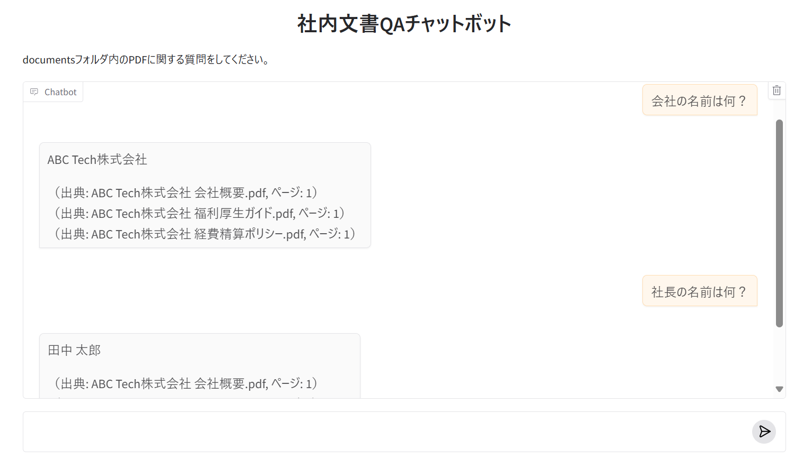

# Corporate QA Chatbot

## 概要
Retrieval-Augmented Generation技術を使用して、指定されたPDFドキュメント群に基づいて質問に回答するチャットボットシステムです。  
ユーザーは質問を日本語で入力でき、チャットボットは関連情報をPDFから検索し、LLMを使用して回答を生成します。

## 実行結果


## 主な機能
- PDFからの情報抽出: 指定されたdocumentsフォルダ内のPDFファイルからテキストを自動的に抽出
- セマンティック検索 (RAG): ユーザーの質問に対して、内容的に関連性の高いPDFのテキストチャンクを高速に検索
- 質問応答: 検索された情報と大規模言語モデルを利用して、ユーザーの質問に対する回答を生成
- 出典の明記: 回答には、参照したPDFのファイル名とページ番号が自動的に付加される
- GradioによるWeb UI: Webインターフェースを提供し、ブラウザからチャット形式で対話

## 使用技術
- 言語: python
- ライブラリ
  - transformers: 大規模言語モデルのロードと推論
  - sentence-transformers: テキストの埋め込みベクトル生成
  - faiss-cpu: 高速なベクトル検索
  - pypdf: PDFからのテキスト抽出
  - bitsandbytes: LLMの量子化
  - gradio: Webベースのチャットインターフェース
  - torch: バックエンドのテンソル計算
  - numpy: 数値計算
  - pathlib: ファイルパス操作

## 導入・実行方法  
### 1. リポジトリをクローン
```bash
git clone https://github.com/N-Ritsu/AIstudy.git  
cd AIstudy/corporate_qa_chatbot
```
### 2.Conda仮想環境の構築と有効化
```bash
conda create --name qa_chatbot_env python=3.12 -y
conda activate qa_chatbot_env
```

### 3. 必要なライブラリをインストール
```bash
pip install -r requirements.txt
```

### 4.PDFファイルの準備
プロジェクトのルートディレクトリに documents という名前のフォルダを作成し、そのフォルダ内にチャットボットの知識としたい内容のPDFファイルを配置してください。  
複数のPDFファイルにも対応しています。

### 5. プログラムを実行  
```bash
python corporate_qa_chatbot.py
```
※私の環境上ではCPUの処理限界の寸前で動作していたため、うまく動作しない場合は、関係ないアプリやブラウザを閉じた状態で実行することをお勧めします。

## 開発を通して
私がこのCorporate QA Chatbotの開発で一番苦労したのは、GPUが使えない環境下にて、CPUの処理限界を考えながらLLMモデルを選択し、それに応じた再設計を行ったことです。  
特に、軽量なLLMモデル特有の、応答の不安定さや不自然さを調整することに難しさを感じました。  
中でも、十分な応答を行っても、なぜかトークンの最大長さまで質問と関係ないことを応答出力を続けてしまうという現象には頭を悩ませられました。  
関係ない質問に移行した際に、改行が２つ続いたり"質問："という出力から始まったりすることが多いということを突き止め、それらを応答終了ワードとして設定することで、自然な回答を実現することができました。  
しかしこのよう応答の制御はかなり無理やりな応急処置であり、きちんとした応答を求めるならやはりもっと別のLLMモデルを使用するべき(私のパソコンだとこのモデルがCPUの処理限界)だと思いました。