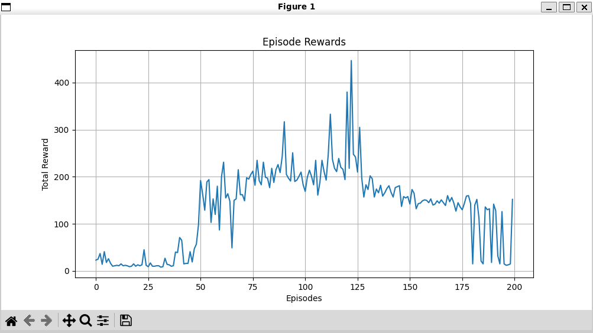
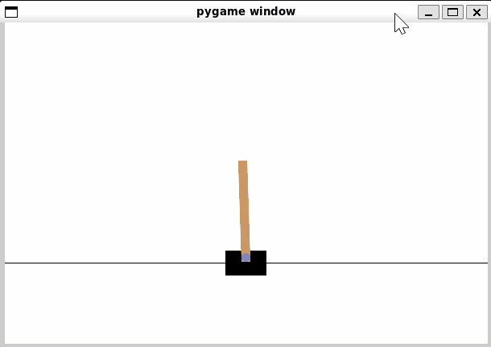

# Deep Q-Network for Cartpole

## 概要
深層強化学習の基本的なアルゴリズムであるDQN（Deep Q-Network）を実装し、古典的な制御問題であるCartPole環境を攻略するAIエージェントを学習させるプログラムです。
AIエンジニアを目指すにあたり、Q学習から一歩進んだ深層強化学習の原理を実践的に理解するために、このプロジェクトを開発しました。

## 実行結果
コンソール画面


学習による報酬推移


検証テスト


## 主な機能
- 状態を入力し、各行動の価値（Q値）を出力するQネットワークをPyTorchで実装
- 学習を安定させるための経験再生機能をリプレイバッファとして実装
- 学習目標を固定し、安定した学習を実現するためのターゲットネットワークを実装
- ε-greedy法により、エージェントの探索と活用のバランスを制御
- GymnasiumライブラリのCartPole-v1環境とエージェントを連携させ、指定されたエピソード数だけ学習を実行
- 学習の進捗（各エピソードで得られた合計報酬）をリアルタイムでコンソールに表示
- 学習完了後、エピソードごとの合計報酬をグラフとしてプロットし、学習曲線を可視化
- 学習済みのエージェントが実際にCartPoleを操作する様子をアニメーションで表示

## 使用技術
・言語
  Python
・ライブラリ
  PyTorch
  Gymnasium
  Matplotlib

## 導入・実行方法  
### 1. リポジトリをクローン  
```bash
git clone https://github.com/N-Ritsu/AIstudy.git  
cd AIstudy/deep_q_network_for_cartpole
```
### 2.Conda仮想環境の構築と有効化
```bash
conda create --name deep_q_network_for_cartpole_env python=3.10 -y
conda activate deep_q_network_for_cartpole_env
```
### 3. 必要なライブラリをインストール
```bash
pip install -r requirements.txt
```
### 4.プログラムを実行
```bash
python deep_q_network_for_cartpole.py
```

## 開発を通して
私はこのDQN for CartPoleの開発が、初めての深層強化学習の実装経験となりました。
この開発で最も難しかったのは、リプレイバッファからサンプリングしたデータでネットワークを学習する内容(learn関数)についてのアルゴリズムの理解です。  
開発当初は、policy_netとtarget_netという二つのネットワークの役割の違いや、loss.backward()の一行でなぜ学習が可能なのかといった部分が直感的に理解できず、実装が停滞していました。  
そこで私は、Tensorとは何か、GPUによるバッチ処理の必要性、そしてPyTorchの自動微分がどのように機能するのかなど、深層学習に基本、しかし外側からは見えない挙動について１から学習し直しました。  
この開発を通して、深層学習についての基礎的な土台となる知識が大幅に強化され、一段と深い理解を行うことができました。