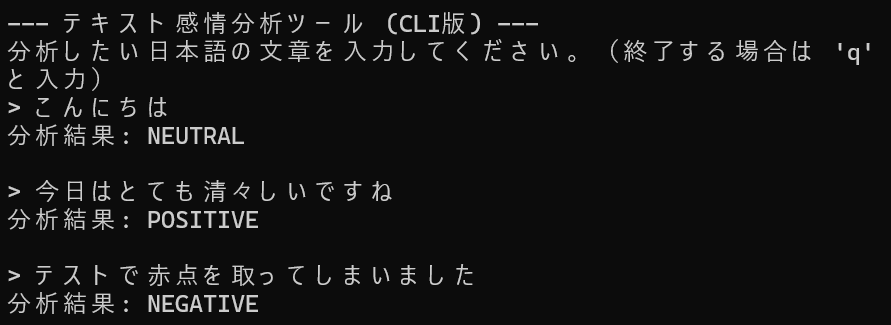
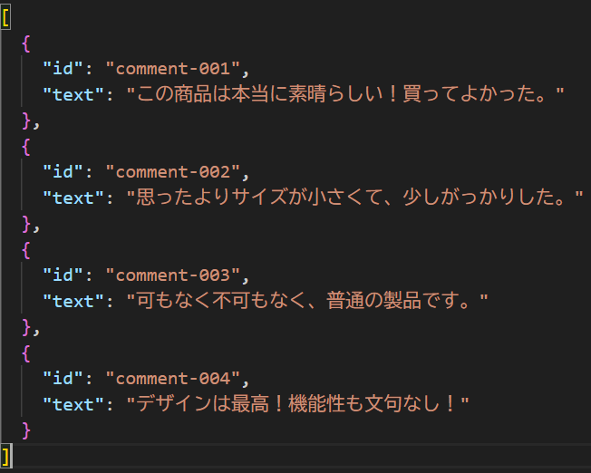
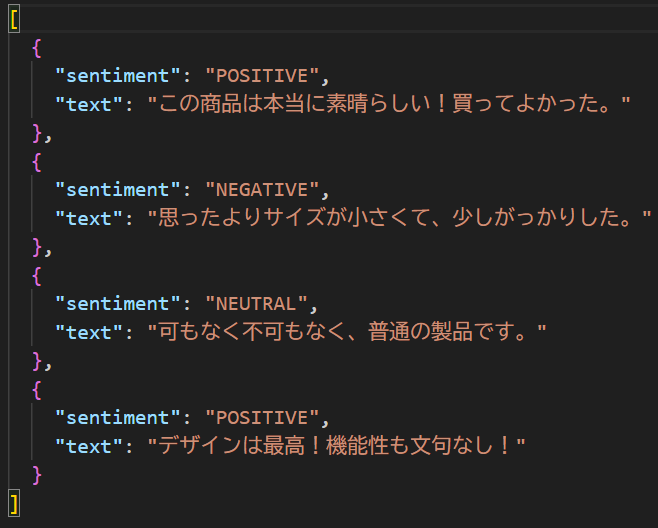

# Emotion Detector by Bert

## 概要
Hugging Faceで公開されている事前学習済みモデルを利用して、日本語テキストの感情を分析し、ブラウザ上・コマンドラインツール・API呼び出しという３種のインタフェースで応答するNLPツールです。  
AIエンジニアを目指すにあたり、自然言語処理の基本的なタスクである感情分析の実装と、開発したAI機能をWebアプリケーションやAPIとして公開する経験を積むために、このプロジェクトを開発しました。

## 実行結果 
・コマンドライン


・Webブラウザ


・API呼び出しによるファイル作成
 → 

## 主な機能
- Hugging Faceの事前学習済みBERTモデルを利用し、高精度な日本語の感情分析を実現
- ブラウザから手軽に使えるWebアプリケーション、ターミナルで対話的に使えるCLIツール、API呼び出しによるファイル操作という3種のインタフェースを搭載
- テキストファイルを読み込み、複数行の文章を一度に分析して結果をCSVファイルに出力。
- 他のプログラムからネットワーク経由で機能を呼び出せるJSONベースのAPIを実装
- 感情分析のコアロジックをクラスとして分離し、WebアプリとCLIから共通して呼び出す再利用性の高い設計を採用

## 使用技術
・言語  
  Python  
・ライブラリ
  transformers
  torch
  Flask
  fugashi
  ipadic
  unidic-lite
  requests
  protobuf

## 導入・実行方法  
### 1. リポジトリをクローン  
```bash
git clone https://github.com/N-Ritsu/AIstudy.git  
cd AIstudy/emotion_detector_by_bert
```
### 2. Conda仮想環境の構築と有効化
```bash
conda create --name emotion_detector_by_bert_env python=3.10 -y
conda activate emotion_detector_by_bert_env
```
### 3. 必要なライブラリをインストール
```bash
pip install -r requirements.txt
```
### 4. プログラムを実行
・コマンドラインツール
```bash
python command_line.py
```
・Webブラウザ
```bash
python app_and_api.py
```
実行後、ブラウザで http://127.0.0.1:5000 にアクセスしてください

・APIクライアントによるJSONファイルの一括処理  
※事前に、input_data.jsonという名前で、jsonデータがリスト状に保存されたデータを準備してください。"text"キーの内容について処理を行うため、感情分析を行いたい文章は"text"キーに保存してください。  

まずはサーバーを起動します
```bash
python app_and_api.py
```
プログラムを実行します
```bash
python api_json_processor.py
```
実行すると、"sentiment"キーに感情分析結果を追加したjsonファイルが、api_result.jsonに保存されます。

## 開発を通して
私はこのEmotion Detector by Bertの開発が、初めての感情分析NLPの実装と、APIとしての公開経験になりました。  
このプロジェクトを進めるにあたって工夫した点は、コマンドラインツール・Webブラウザ・API呼び出しという様々なシステム提供方法を組み込んだことです。これにより、各方法の実装の違いについて理解を深めることができました。  
また、様々なシステム提供方法を作成する中で、コアロジックを分離させて、インタフェース部分のみを3種用意するリファクタリングを行うことで、再利用性を高めることができました。