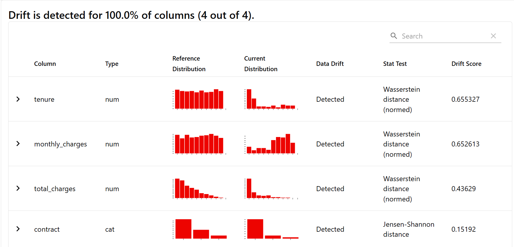

# Evidently Churn Monitor

## 概要
顧客の解約を予測する機械学習モデルをFlaskでAPI化し、本番環境で発生しうるデータドリフトをEvidently AIライブラリを用いて監視・検知するプロジェクトです。  
AIモデルは一度デプロイすれば終わりではなく、時間の経過と共に変化するデータによって性能が劣化します。このプロジェクトは、AIアプリケーションエンジニアにとって不可欠なモデルモニタリングを実践的に学ぶために開発しました。

## 実行結果


## 主な機能
- scikit-learnを用いて、顧客の契約期間や月額料金から解約確率を予測する分類モデル（LightGBM）を学習
- Flaskフレームワークを使用し、学習済みモデルをリアルタイムで予測リクエストに応答するWeb APIとして提供
- APIへのリクエストデータとモデルの予測結果を、本番環境のログとしてCSVファイルに自動で記録
- 意図的にデータドリフトを発生させるシミュレーションスクリプトを実装し、学習時とは異なるパターンのデータが本番環境で入力される状況を再現
- Evidently AIライブラリを用い、モデル学習時のベースラインデータと、本番環境の現在のデータを統計的に比較
- データドリフトが検知された特徴量とその分布の変化を、インタラクティブなHTMLレポートとして自動生成

## 使用技術
・言語
  Python
・ライブラリ
  scikit-learn
  LightGBM
  pandas
  numpy
  Flask
  Evidently AI
  joblib
  requests

## 導入・実行方法
### 1. リポジトリをクローン
```bash
git clone https://github.com/N-Ritsu/AIstudy.git
cd AIstudy/evidently_churn_monitor
```
### 2. Conda仮想環境の構築と有効化
```bash
conda create --name evidently_churn_monitor_env python=3.10 -y
conda activate evidently_churn_monitor_env
```
### 3. 必要なライブラリをインストール
```bash
pip install -r requirements.txt
```
### 4. モデルの学習とベースラインデータを作成
```bash
python train_churn_model.py
```
実行後、monitoring_artifactsフォルダにchurn_model.pklとreference_data.csvが作成されます。
### 5. APIサーバーの起動
このターミナルは、以降のステップが完了するまで実行したままにしてください。
```bash
python app.py
```
### 6. トラフィックのシミュレーション
```bash
python simulate_traffic.py
```
実行後、monitoring_artifactsフォルダにproduction_logs.csvが作成されます。
### 7. ドリフトレポートの生成
```bash
python monitor_model.py
```
実行すると、monitoring_artifacts/model_drift_report.htmlが生成されます。
### 8. 結果の確認
生成されたmonitoring_artifacts/model_drift_report.htmlをWebブラウザで開くと、データドリフトの分析結果を視覚的に確認できます。

## 開発を通して
私はこのevidently_churn_monitorの開発が、初めてのモデルモニタリングプログラムの実装経験となりました。  
結果を見ると、従来のデータは様々なユーザーが満遍なく存在していたのに対し、最新のデータでは高額な短期プランを選択したユーザーに偏っていることが一目で比較できるようになっていました。これより、ランダムに生成した従来データと、データドリフトを含んだ最新データをしっかりと捉えていることが分かります。  
そして、Evidently AIにより、４種の特徴量全てにおいて、現在のデータでは従来の学習で対応できないことを示しました。データの変動を確実に捉え、モデルの劣化を視覚的に分かりやすい理由と共に可視化できる点に、重要性を実感しました。