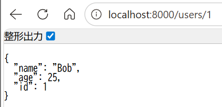
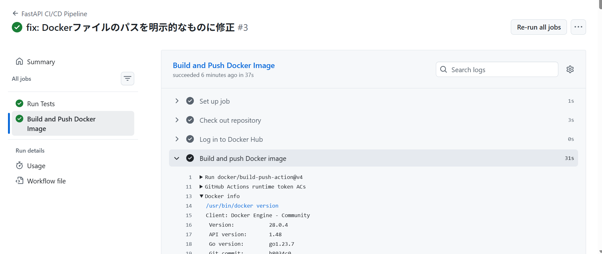

# FastAPI CRUD Project

## 概要
FastAPIを用いて構築したシンプルなCRUDを行うAPIサーバーに対し、GitHub Actionsを利用してCI/CDパイプラインを構築するプロジェクトです。  
AIに強いアプリケーションエンジニアを目指す上で、単にAIモデルを搭載したアプリケーションを開発するだけでなく、その品質を自動で担保し、デプロイ可能な成果物を継続的に生成するというMLOps/DevOpsの基本的なワークフローを実践するために開発しました。

## 実行結果
APIサーバーを起動し、ブラウザでアクセスした結果


workflow実行結果


## 主な機能
FastAPIによるAPIサーバー
  - Pydanticを用いた厳格なデータバリデーションを持つ、ユーザー情報の作成・読み取りAPIを実装。
  - lifespanイベントハンドラにより、サーバー起動時にインメモリデータベースを初期化。
  - Swagger UIによるAPIドキュメントを自動生成。

pytestによる自動テスト
  - FastAPIのTestClientを利用し、実際にサーバーを起動することなくAPIエンドポイントの正常系・異常系テストを実装。
  - テストの独立性を確保し、信頼性の高いテストスイートを構築。

Dockerによるコンテナ化
  - Dockerfileを定義し、アプリケーションとその依存関係をポータブルなコンテナイメージとしてパッケージング。
  - 本番グレードのWebサーバーuvicornを用いてアプリケーションを実行。

GitHub ActionsによるCI/CDパイプライン:
  - mainブランチへのプッシュまたはプルリクエストをトリガーとしてワークフローを自動実行。
  - CI (継続的インテグレーション): pytestを自動実行し、コードの品質と後方互換性を担保。
  - CD (継続的デリバリー): テストが成功した場合にのみ、アプリケーションのDockerイメージをビルドし、Docker Hubへ自動でプッシュ。

## 使用技術
・言語
  Python
・Webフレームワーク
  FastAPI
・テストフレームワーク
  pytest
・CI/CD
  GitHub Actions
・コンテナ技術
  Docker
・コンテナレジストリ
  Docker Hub

## 導入・実行方法
## Dockerイメージを取得し、ブラウザで実行する方法
### 0. 前提
Dockerがインストールされていることを前提とします。
### 1. Docker Hubからイメージを取得
ターミナルを開き、以下のコマンドを実行して、Docker Hubに公開されたコンテナイメージをダウンロードします。
```bash
docker pull nritsu/fastapi_crud_project:latest
```
### 2. コンテナとしてAPIサーバーを起動
ダウンロードしたイメージを使って、APIサーバーを起動します。
```bash
docker run -d -p 8000:80 --name my-fastapi-server nritsu/fastapi_crud_project:latest
```
### 3. ブラウザで確認
Webブラウザで http://localhost:8000/docs にアクセスしてください。Swagger UIが表示され、そこから直接Try it outボタンでAPIをテストできます。

## Dockerイメージを取得し、ターミナルで実行する方法
### 0. 前提
Dockerがインストールされていることを前提とします。
### 1. Docker Hubからイメージを取得
ターミナルを開き、以下のコマンドを実行して、Docker Hubに公開されたコンテナイメージをダウンロードします。
```bash
docker pull nritsu/fastapi_crud_project:latest
```
### 2. コンテナとしてAPIサーバーを起動
ダウンロードしたイメージを使って、APIサーバーを起動します。
```bash
docker run -d -p 8000:80 --name my-fastapi-server nritsu/fastapi_crud_project:latest
```
### 3. ターミナルで確認
・ユーザー情報を取得
```bash
curl http://localhost:8000/users/user_id
```
※user_idの部分には、取得したいユーザーのIDを入力してください。ID: 0, 1は、デフォルトで設定されています。
・新しいユーザーを作成
```bash
curl -X POST -H "Content-Type: application/json" -d '{"name":"David","age":50}' http://localhost:8000/users/
```

## 開発環境でソースコードから実行・テストする方法
### 1. リポジトリをクローン
```bash
git clone https://github.com/N-Ritsu/AIstudy.git
cd AIstudy/fastapi_crud_project
```
### 2. Conda仮想環境の構築と有効化
```bash
conda create --name fastapi_crud_project_env python=3.10 -y
conda activate fastapi_crud_project_env
```
### 3. 必要なライブラリをインストール
```bash
pip install -r requirements.txt
```
### 4. ユニットテストを実行
```bash
pytest
```
### 5. 開発サーバーを起動
uvicornを使ってローカルでAPIサーバーを起動します。
```bash
uvicorn app.main:app --reload
```
サーバーが起動したら、ブラウザで http://127.0.0.1:8000/docs にアクセスして動作を確認できます。

## 開発を通して
私はこのFastAPIプロジェクトの開発が、初めてのCI/CDパイプラインの構築経験になりました。  
これまで個別の技術として学んできた、テスト・コンテナ化・バージョン管理が、GitHub Actionsという一つのワークフローの中で連携し、コードの品質保証からデプロイ可能な成果物の作成までを全自動で行う点に、DevOps/MLOpsの強力さと必要性を強く実感しました。  
プッシュするだけで、Docker Hubにストックするまでの一連の流れを自動的に行ってくれるということは、開発を行う上で効率と信頼性の両方の面で重要だと感じました。