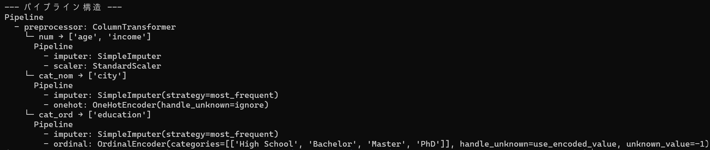
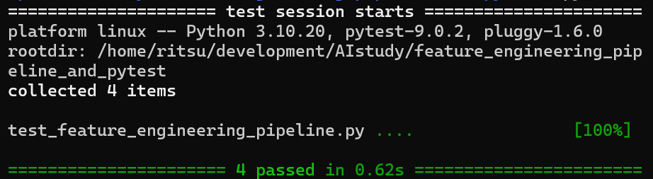

# Feature Engineering Pipeline and Pytest

## 概要
scikit-learnのPipelineとColumnTransformerを用いて、機械学習の前処理パイプラインを構築するプロジェクトです。さらに、そのパイプラインが意図通りに動作することを保証するため、pytestを用いた単体テストを実装しています。  
AIエンジニアとして、モデルの精度だけでなく、コードの品質、保守性、そして信頼性を担保するスキルを磨くため、本番環境でも通用する堅牢な機械学習ワークフローの構築方法を深く理解するために開発しました。

## 実行結果
パイプライン構造


Pytest実行結果


## 主な機能
- PipelineとColumnTransformerを組み合わせ、一連の前処理（欠損値補完、スケーリング、カテゴリ変数エンコーディング）を一つのオブジェクトに統合
- 数値データ、名義カテゴリ変数、順序カテゴリ変数といった、型の異なる特徴量に対してそれぞれ最適な前処理を自動で適用
- 前処理パイプラインと機械学習モデルを連結し、学習(fit)から予測(predict)までの一貫した処理フローを構築
- pytestフレームワークを利用し、パイプラインの各コンポーネントと全体に対する単体テストを実装
  - 数値処理パイプラインが正しくスケーリングを行うかテスト
  - ColumnTransformerが期待される出力形式（shape）を返すかテスト
  - モデル全体がエラーなく学習・予測を実行できるかテスト
- パイプラインのネストされた複雑な構造を、インデントを調整して分かりやすく表示する独自の関数を実装

## 使用技術
・言語
  Python
・ライブラリ
  pandas
  scikit-learn
  numpy
  pytest

## 導入・実行方法
### 1. リポジトリをクローン
```bash
git clone https://github.com/N-Ritsu/AIstudy.git
cd AIstudy/feature_engineering_pipeline_and_pytest
```
### 2. Conda仮想環境の構築と有効化
```bash
conda create --name feature_engineering_pipeline_and_pytest_env python=3.10 -y
conda activate feature_engineering_pipeline_and_pytest_env
```
### 3. 必要なライブラリをインストール
```bash
pip install -r requirements.txt
```
### 4 . プログラムを実行
```bash
python feature_engineering_pipeline.py
```
### 5. テストを実行
```bash
pytest
```

## 開発を通して
私はこのfeature_engineering_pipeline_and_pytestの開発が、初めてのパイプラインを用いたシステムの開発、およびテストの実装経験となりました。  
様々な処理をパイプラインにまとめる難しさと理解の複雑さに頭を悩ませましたが、パイプラインの構造を表示する関数を作成する経験が、パイプラインの構造把握を強く後押ししてくれました。  
このプロジェクトを通して、パイプラインによる機械学習コードの品質管理とテストを実装する経験を積み、実務的で堅牢なプロジェクトを開発することができました。