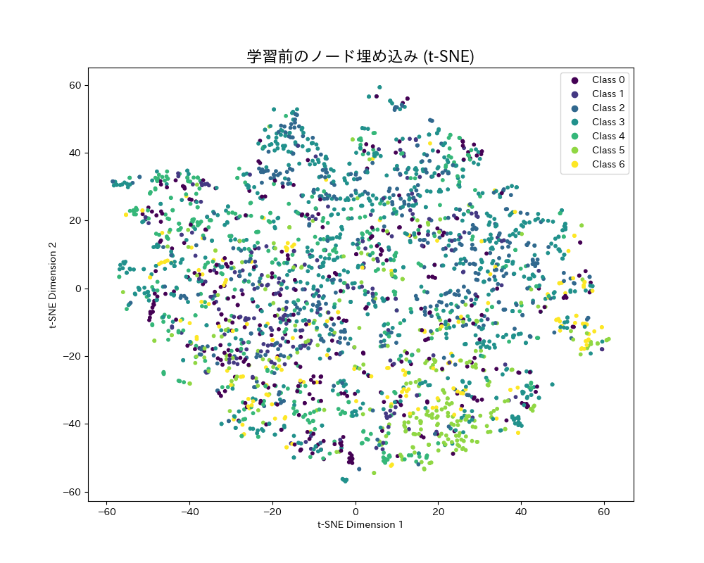
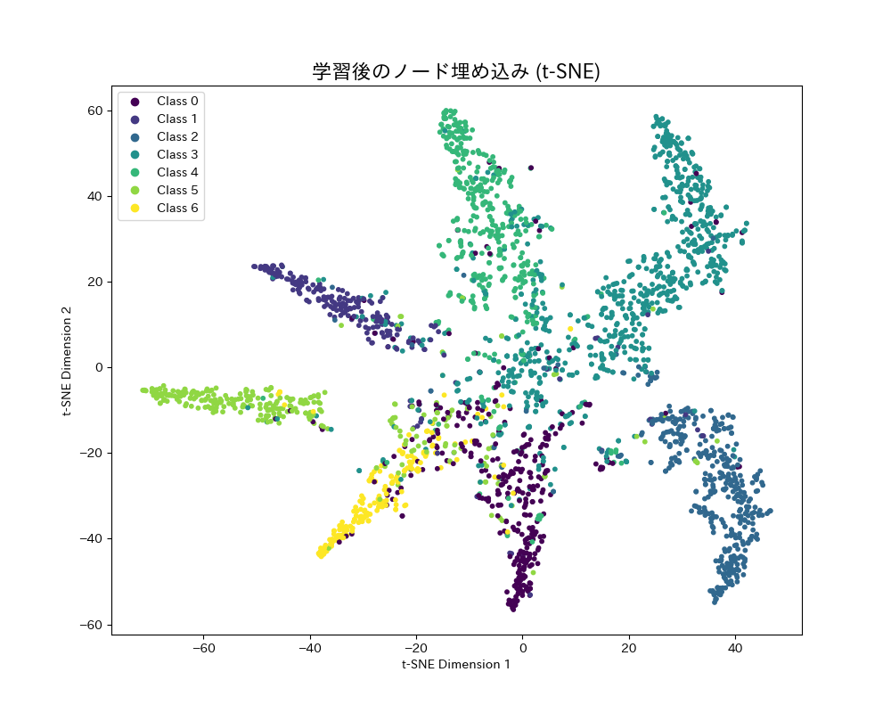

# GNN Cora Classifier

## 概要
グラフニューラルネットワーク（GNN）の一種であるGCNを用い、学術論文の引用関係グラフから各論文の専門分野を分類するプロジェクトです。  
AIエンジニアを目指すにあたり、従来の機械学習では扱いきれなかったデータ間の関係性を直接モデル化するGNNの基本原理と、その学習プロセスを深く理解するために開発しました。

## 実行結果
学習前


学習後


## 主な機能
- PyTorch Geometricライブラリを使用し、標準的なベンチマークであるCoraデータセットを自動で取得
- GCN（Graph Convolutional Network）モデルをPyTorchで構築
- グラフ全体のノード特徴量と接続情報（エッジ）を用いて、半教師あり学習でノード分類タスクを実行
- 学習済みモデルの最終的なテスト精度を評価
- t-SNEアルゴリズムを用いて、高次元のノード埋め込み（モデルが学習した特徴表現）を2次元に削減
- 学習前後のノード埋め込みを散布図としてプロットし、GNNの学習効果を視覚的に比較・分析
- 分析結果を画像ファイルとして自動で保存

## 使用技術
・言語
  Python
・ライブラリ
  PyTorch
  PyTorch Geometric
  scikit-learn
  matplotlib
  numpy

## 導入・実行方法
### 1. リポジトリをクローン
```bash
git clone https://github.com/N-Ritsu/AIstudy.git
cd AIstudy/gnn_cora_classifier
```
### 2. Conda仮想環境の構築と有効化
```bash
conda create --name gnn_cora_classifier_env python=3.10 -y
conda activate gnn_cora_classifier_env
```
### 3. 必要なライブラリをインストール
```bash
pip install -r requirements.txt
```
### 4 . プログラムを実行
```bash
python gnn_cora_classifier.py
```
実行すると、embeddings_before_training.pngとembeddings_after_training.pngが生成されます。

## 開発を通して
私はこのgnn_cora_classifierの開発が、初めてのグラフ構造データを扱った機械学習の実装経験となりました。  
実行結果として、最初はバラバラだったデータ点が、中心から外側へ向けてまるで棘のような形状にクラスタを形成したことから、GNNの各データ間の関係性を捉える特徴がはっきりと表れていて、表現力の高さを実感しました。  
この実行結果から、専門分野に特化した論文はどれか、そして逆に複数分野に横断しているような論文はどれかといった、各分野と論文の関係性を可視化することができました。