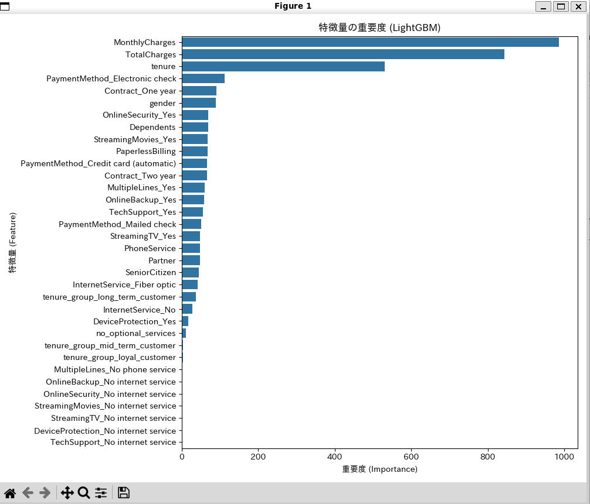
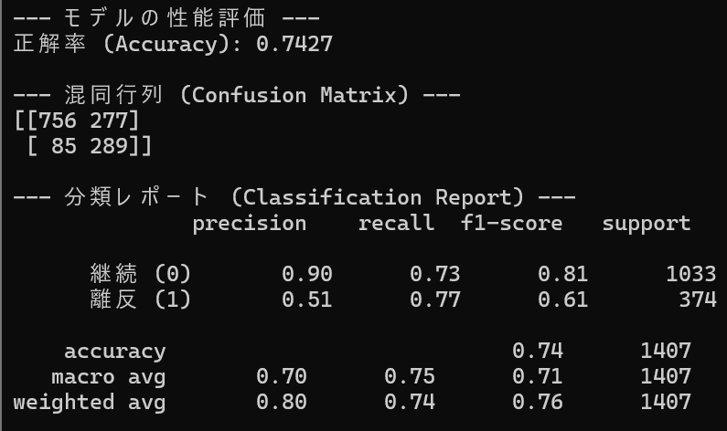

# Gradient Boosting for Customer Churn Prediction

## 概要
通信会社の顧客データセットを用いて、顧客がサービスを解約するかどうかを予測する機械学習プログラムです。
AIエンジニアを目指すにあたり、強力なアンサンブル学習モデルである勾配ブースティングの実装経験を積むために、このプロジェクトを開発しました。

## 実行結果
結果グラフ


モデルの評価



## 主な機能
- Kaggleで公開されている「Telco Customer Churn」データセットを使用
- データの前処理（欠損値処理、カテゴリ変数の数値化）を実装
- 特徴量エンジニアリングにより、契約期間のグループ化、オプションサービスの未契約フラグといった予測に有効な新しい特徴量を独自に作成
- LightGBM（勾配ブースティングライブラリ）を用いて、顧客の離反を予測する二値分類モデルを構築
- 不均衡データを考慮した学習を実行
- Optunaによる自動ハイパーパラメータチューニングを実装し、モデルの性能を最大化
- 学習済みモデルの性能を、正解率だけでなく再現率・適合率・F1スコアといった多角的な指標で評価
- モデルがどの特徴量を重要視したかを可視化し、予測の根拠を解釈

## 使用技術
・言語
  Python
・ライブラリ
  pandas
  numpy
  scikit-learn
  lightgb
  optuna
  matplotlib
  seaborn

## 導入・実行方法
### 1. リポジトリをクローン
```bash
git clone https://github.com/N-Ritsu/AIstudy.git
cd AIstudy/gradient_boosting_for_customer_churn_prediction
```
### 2. データセットのダウンロードと配置
本プログラムは、Kaggleで公開されているデータセットを使用します。
こちらのリンク(https://www.kaggle.com/datasets/blastchar/telco-customer-churn)から、Kaggleのデータセットページにアクセスしてください。
Kaggleにログイン（または新規登録）し、Downloadボタンをクリックしてデータセットをダウンロードします。
ダウンロードしたZIPファイルを解凍し、中に入っている WA_Fn-UseC_-Telco-Customer-Churn.csv ファイルを、ステップ1でクローンしたこのプロジェクトのディレクトリに配置してください。
### 3. Conda仮想環境の構築と有効化
```bash
conda create --name gradient_boosting_for_customer_churn_prediction_env python=3.10 -y
conda activate gradient_boosting_for_customer_churn_prediction_env
```
### 4. 必要なライブラリをインストール
```bash
pip install -r requirements.txt
```
### 5. プログラムを実行
```bash
python gradient_boosting_for_customer_churn_prediction.py
```

## 開発を通して
私はこのGradient Boosting for Customer Churn Predictionの開発が、初めての勾配ブースティングを用いたシステム開発経験となりました。  
このプロジェクトを開発するうえで、単に高性能モデルを構築するだけでなく、ビジネス上の目的を深く理解し、目的のためにシステムを構築するということについて学びました。  
具体的には、このシステムを活用するうえで、"離反する可能性のある顧客を捕捉すること"が一番重要なのではないかと私は考えました。そのため、当初はモデル全体の正解率を高めることを追い求めていましたが、離反可能性についての再現率に着目すべきなのではないかと考え、不均衡データへの対処を行ったり特徴量エンジニアリングを導入することで、再現率を高めました。  
結果、全体の正解率は0.7910から0.7427まで下がってしまいましたが、離反の再現率について、適合率を下げずに0.55から0.77まで劇的に改善することができました。ただ精度をやみくもに追うのではなく、目的に合わせた調節が必要なのだということを改めて実感しました。