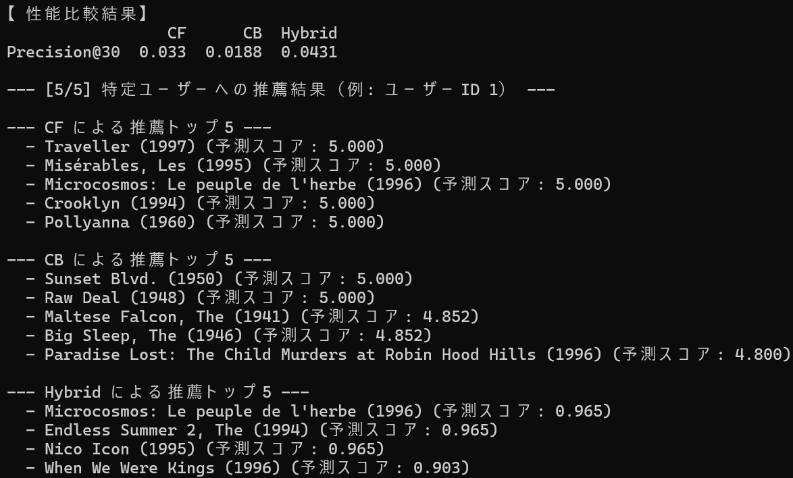

# Hybrid Recommender Analysis

## 概要
協調フィルタリング、コンテンツベース推薦、そして両者を組み合わせたハイブリッド推薦という、3つの異なるアプローチを実装・比較するプロジェクトです。  
AIエンジニアを目指すにあたり、各推薦システムについて深く理解するために開発しました。

## 実行結果


## 主な機能
- 3種類の推薦アルゴリズムを実装
  - 協調フィルタリング: ユーザー間の評価傾向の類似度（コサイン類似度）に基づいて推薦
  - コンテンツベース推薦: アイテムの属性（映画のジャンル）の類似度（TF-IDFとコサイン類似度）に基づいて推薦
  - ハイブリッド推薦: 上記2つのモデルの予測スコアを重み付けして統合し、推薦
- MovieLens 100kデータセットを自動でダウンロード・展開
- Precision@K指標を用いて、各モデルの性能を定量的に比較・評価
- 特定のユーザーに対し、各モデルが実際にどのようなアイテムを推薦するかを具体的に表示

## 使用技術
・言語
  Python
・ライブラリ
  pandas
  numpy
  scikit-learn
  requests

## 導入・実行方法
### 1. リポジトリをクローン
```bash
git clone https://github.com/N-Ritsu/AIstudy.git
cd AIstudy/hybrid_recommender_analysis
```
### 2. Conda仮想環境の構築と有効化
```bash
conda create --name hybrid_recommender_analysis_env python=3.10 -y
conda activate hybrid_recommender_analysis_env
```
### 3. 必要なライブラリをインストール
```bash
pip install -r requirements.txt
```
### 4 . プログラムを実行
```bash
python hybrid_recommender_analysis.py
```

## 開発を通して
私はこのhybrid_recommender_analysisの開発が、初めての推薦アルゴリズムの比較経験となりました。  
結果として、やはりハイブリッドモデルの方が単一のモデルより精度が高く、また予測スコアにも深みが増していることが分かりました。単一のモデルの精度を追い求めるより、複数のモデルを組み合わせることで効率よく高精度を実現できることを学びました。  
しかし一方で、今回のデータセットでは、全体的に精度が低い結果となりました。これは、今回のデータセットが、ユーザーが見たことのない映画がNaNとなっている非常に疎なデータセットであったことが原因であると考えられます。