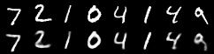
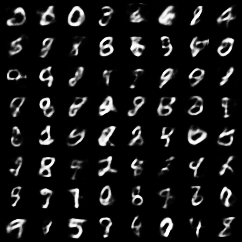

# Image Generator By Mnist

## 概要
手書き数字のデータセット(MNIST)を用いて、変分オートエンコーダ(VAE)という深層学習モデルを学習させることで、新たな手書き数字の画像を生成するプログラムです。
AIエンジニアを目指すにあたり、PyTorchを用いた深層学習モデルの実装と、VAEによる画像生成の経験を積むために、このプロジェクトを開発しました。

## 実行結果
再構成画像の比較 (上段: 元画像, 下段: VAEによる再構成画像)



VAEによって新たに生成された手書き数字



## 主な機能
- MNISTデータセット(学習用60,000枚、テスト用10,000枚)をダウンロード
- PyTorchを用いてVAEモデルを構築
- 構築したモデルを学習させ、1エポックごとにテストデータに対する損失を評価
- 各エポックの終了時に、モデルが学習した潜在空間からランダムに画像を生成し、pngファイルとして保存
- 各エポックの終了時に、テストデータとその再構成画像を並べた比較画像をpngファイルとして保存

## 使用技術
・言語
  Python
・ライブラリ
  torch
  torchvision

導入・実行方法
1. リポジトリをクローン
```bash
git clone https://github.com/N-Ritsu/AIstudy.git
cd AIstudy/image_generator_by_mnist
```
### 2. 必要なライブラリをインストール
```bash
pip install -r requirements.txt
```
### 3. プログラムを実行
```bash
python image_generator_by_mnist.py
```
実行すると、dataフォルダとresultsフォルダが自動で作成されます。resultsフォルダ内に、各エポックの再構成画像と生成画像が保存されていきます。

## 開発を通して
私はこの手書き数字ジェネレーターの開発が、初めての深層学習による画像生成経験となりました。  
この開発で一番難しかったのは、エンコーダとデコーダの理解です。特にエンコーダの特徴量の抽出の仕組みについては、しっかりと理解するまでに時間を要しました。  
また、BCEやKLDの計算方法とその有用性についても難解に感じましたが、統計解析の検定をとるために学習した経歴が功を奏し理解することができました。統計解析で学習したことは、実際にこのような形で深層学習に使われているのだという具体例を得たことでより一層統計解析についての理解が深まったと思います。
