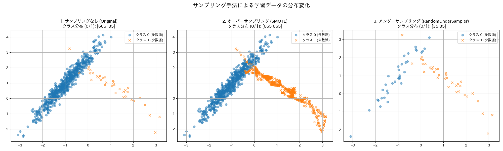
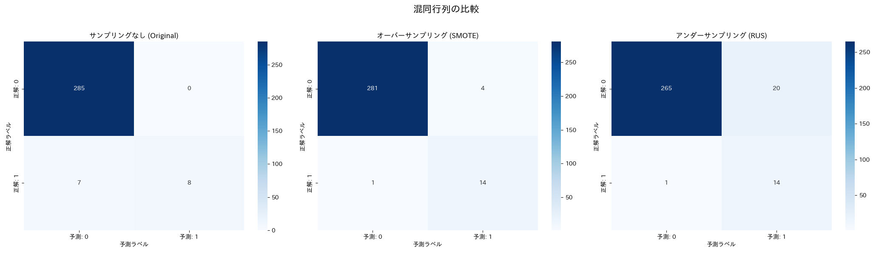
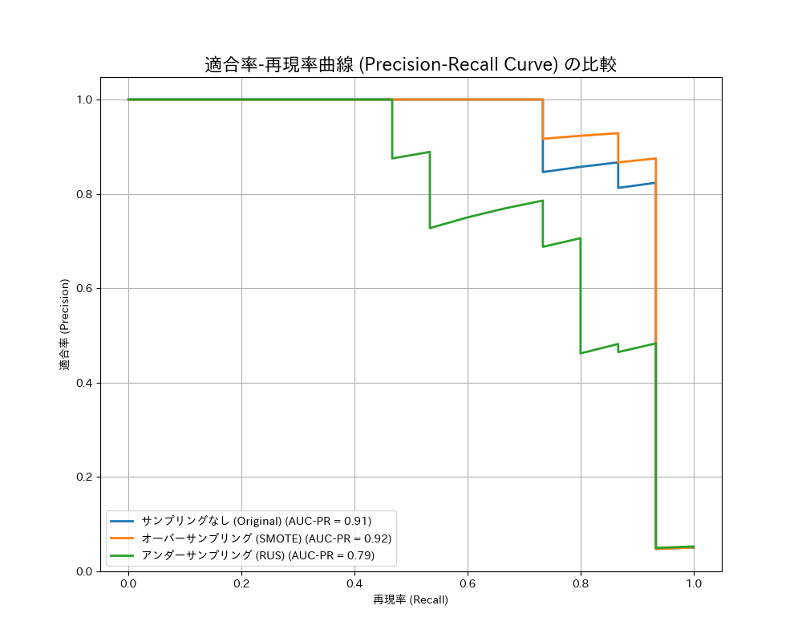
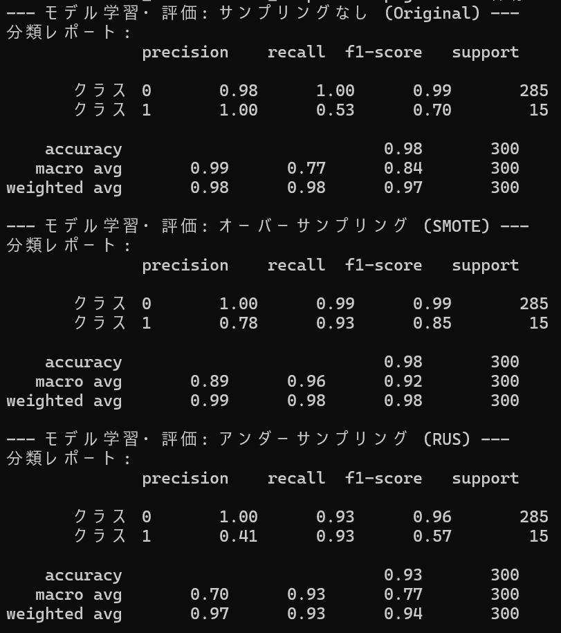

# Imbalanced Data Sampler Comparison

## 概要
不均衡なデータセットにおける分類問題で、モデルの性能がどのように偏るか、そしてその問題を解決するためのサンプリング手法（オーバーサンプリング/アンダーサンプリング）がどのような効果をもたらすかを比較・分析するプロジェクトです。  
AIエンジニアを目指すにあたり、現実世界の多くの課題で直面する不均衡データ問題への対処法を深く理解するために開発しました。適切な評価指標の選択、サンプリング手法の適用、そしてその結果の定量的・視覚的な評価という一連のプロセスを実践します。

## 実行結果
学習データ散布図


混同行列


適合率-再現率曲線


モデルの性能評価


## 主な機能
- scikit-learnライブラリを使用し、クラス比率が偏った不均衡なデータセットを自動で生成。
- imbalanced-learnライブラリを活用し、代表的なサンプリング手法を実装。
  - オーバーサンプリング: SMOTE (Synthetic Minority Over-sampling Technique) を用い、少数派クラスのデータを人工的に生成。
  - アンダーサンプリング: RandomUnderSamplerを用い、多数派クラスのデータをランダムに削減。
- 3つのケース（サンプリングなし、オーバーサンプリング、アンダーサンプリング）でそれぞれロジスティック回帰モデルを学習。
- 学習済みモデルの性能を、不均衡データに適した指標（再現率、適合率、F1スコア）を含む分類レポートで詳細に評価。
- 各手法の性能を、混同行列と適合率-再現率曲線（P-R Curve）で視覚的に比較・分析。
- 分析結果のグラフを画像ファイルとして自動で保存。

## 使用技術
・言語
  Python
・ライブラリ
  pandas
  scikit-learn
  imbalanced-learn
  matplotlib
  seaborn
  numpy
  japanize-matplotlib

## 導入・実行方法
### 1. リポジトリをクローン
```bash
git clone https://github.com/N-Ritsu/AIstudy.git
cd AIstudy/imbalanced_data_sampler_comparison.py
```
### 2. Conda仮想環境の構築と有効化
```bash
conda create --name imbalanced_data_sampler_comparison.py_env python=3.10 -y
conda activate imbalanced_data_sampler_comparison.py_env
```
### 3. 必要なライブラリをインストール
```bash
pip install -r requirements.txt
```
### 4 . プログラムを実行
```bash
python imbalanced_data_sampler_comparison.py.py
```
実行すると、data_distribution_comparison.pngとconfusion_matrix_comparison.pngとprecision_recall_curve_comparison.pngが生成されます。

## 開発を通して
私はこのimbalanced_data_sampler_comparison.pyの開発が、初めてのオーバーサンプリング/アンダーサンプリングを用いた学習による分類システムの実装となりました。  
今回のデータでの結果は、サンプリングなしの少数派クラスの再現率が0.53であったのに対し、オーバーサンプリングが0.93と、非常に高い数値を記録し、不均衡なデータセットにおけるオーバーサンプリングの優位性を実感することができました。  
一方、アンダーサンプリングでは、少数派クラスの再現率は0.93と高かったものの、少数派クラスの適合率が0.41と低く、f1-scoreはサンプリングなしの時よりも下がってしまいました。これは、学習に用いるデータの数が減ったことにより、十分な学習が行えなかったことに由来すると考えられます。このことから、そのデータに合ったサンプリング方法でないと、逆に精度が低下する可能性があるという新たな視点を得ることができました。  
しかし、アンダーサンプリングの強みとして、データ量が減ることによるデータセットのコンパクト化が挙げられます。特に散布図で分かりやすく、これは膨大なデータセットを扱う際の計算量の低減や、複雑なデータセットを単純化して分かりやすくしたい場面で有効だと思いました。