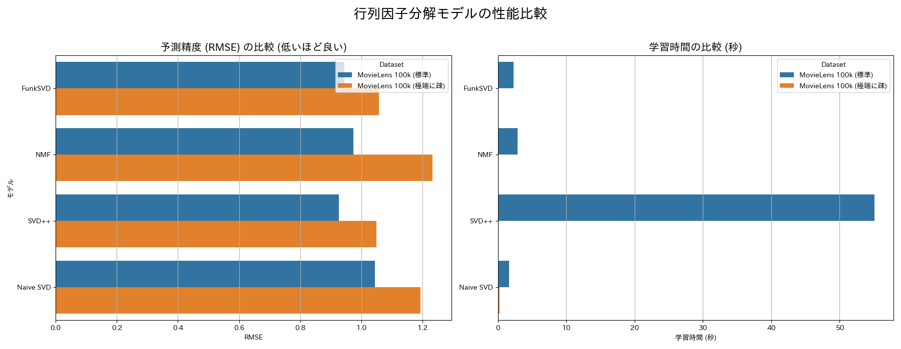
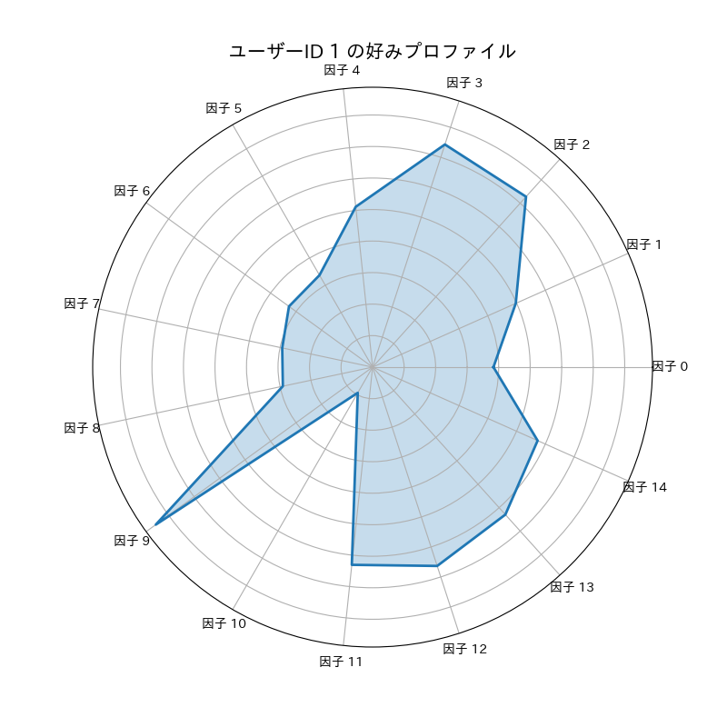

# Matrix Factorization Comparison

## 概要
代表的な行列因子分解であるNaive SVD・NMF・SVD++・FunkSVDという4つの手法を、異なる特性を持つデータセットで比較・評価し、その予測精度と解釈性を分析するプロジェクトです。  
AIエンジニアとして推薦システムの基礎技術を深く理解するため、各行列因子分解モデルの特徴を知るために開発いたしました。

## 実行結果
行列因子分解モデルの性能比較


NFMモデルの解釈性の可視化


## 主な機能
- 以下の代表的な行列因子分解モデルを実装し、性能（RMSE, MAE, 学習時間）を比較
  - Naive SVD: 欠損値を平均で埋める最も単純なSVD
  - FunkSVD: 勾配降下法を用いる実用的な標準モデル
  - NMF: 解釈性に優れた非負値行列因子分解
  - SVD++: ユーザーの暗黙的フィードバックも考慮する高精度モデル
- 標準的なMovieLens 100kデータセットに加え、評価の99%を意図的に削除した極端に疎なデータセットを生成。データが乏しい環境下での各モデルの頑健性を評価
- 解釈性の可視化:
  - 解釈性に優れたNMFモデルが、データからどのような映画の潜在的ジャンルを発見したかを、各ジャンルを代表する映画リストとして出力
  - 特定ユーザーの好みを、各潜在的ジャンルへの嗜好度としてレーダーチャートで視覚的に表現
- surpriseライブラリの交差検証機能を用いて、モデルの汎化性能を評価
- 分析結果のグラフを画像ファイルとして自動で保存

## 使用技術
・言語
  Python
・ライブラリ
  surprise
  scikit-learn
  pandas, numpy
  matplotlib, seaborn
  japanize-matplotlib

## 導入・実行方法
### 1. リポジトリをクローン
```bash
git clone https://github.com/N-Ritsu/AIstudy.git
cd AIstudy/matrix_factorization_comparison
```
### 2. Conda仮想環境の構築と有効化
```bash
conda create --name matrix_factorization_comparison_env python=3.10 -y
conda activate matrix_factorization_comparison_env
```
### 3. 必要なライブラリをインストール
```bash
pip install -r requirements.txt
```
### 4. データセットを保存
```bash
python download_movielens.py
```
実行するとml-100k-dataがダウンロードされます。
### 5. プログラムを実行
```bash
python matrix_factorization_comparison.py
```
実行すると、mf_comparison_results.pngとnmf_user_profile_radar.pngが生成されます。

## 開発を通して
私はこのmatrix_factorization_comparisonの開発が、初めての行列因子分解を用いたシステム開発経験となりました。  
行列因子の理解が難しく、各手法の具体的な中身を理解するのに苦労しました。  
このプロジェクトを通して、各モデルに以下のような特長があるのが分かりました。これにより、各手法の使い分けについて理解を深めることができました。    
・Naive SVD: 最も高速な手法。しかし、精度が低い。  
・NMF: 精度が低く、疎なデータではNaive SVDにも劣ることがあるが、解釈性が高く人間が理解しやすい。  
・SVD++: 精度が一番高く、データが疎になってもそこまで精度が落ちない頑健性があるが、他の手法に比べ圧倒的に時間がかかる。  
・FunkSVD: Naive SVDより少し時間がかかるが、そのかわり比較的高い精度を誇る。時間と精度の両方が高水準な、バランスの良い手法。  