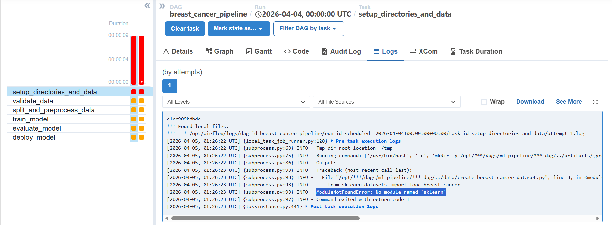
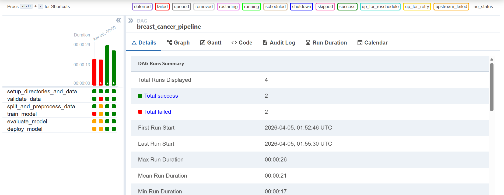

# ML Pipeline Project

## 概要
Apache Airflowを使用し、機械学習モデルの学習・評価・デプロイといった一連のプロセスを自動化するMLパイプラインを構築するプロジェクトです。  
AIに強いアプリケーションエンジニアを目指す上で、モデルを開発するだけでなく、それを安定的に運用し、ビジネス価値に繋げ続けるためのMLOps技術の重要性を理解するために開発しました。

## 実行結果
airflow, エラーログ


airflow, 実行成功


## 主な機能
- DockerとDocker Composeを使用し、依存関係を含めた実行環境をコンテナとして構築。再現性の高いパイプライン実行を実現。
- Apache Airflowを用い、データ検証からモデルのデプロイ判断までの一連のタスクをDAG（有向非巡回グラフ）として定義。
- 各処理ステップを独立したタスクとして定義し、それらの実行順序をAirflowが管理。
- 定義されたスケジュールに従い、パイプラインを自動的に実行。
- 学習済みモデルの性能（F1スコア）を自動で評価し、事前に設定した閾値を超えた場合にのみ本番用モデルとしてデプロイする仕組みを実装。
- AirflowのWeb UIを通じて、各パイプラインの実行状況、成功/失敗、そして各タスクの詳細なログを一元的に監視。

## 使用技術
・言語
  Python
  Bash
・ライブラリ
  scikit-learn
  pandas
・オーケストレーター
  Apache Airflow
・コンテナ技術
  Docker
  Docker Compose

## 導入・実行方法
### 0. 前提条件
DockerおよびDocker Composeをインストールしていること。
### 1. リポジトリをクローン
```bash
git clone https://github.com/N-Ritsu/AIstudy.git
cd AIstudy/ml_pipeline_setup
```
### 2. Airflowの初期設定を行う
```bash
mkdir -p ./logs ./plugins ./config
echo -e "AIRFLOW_UID=$(id -u)\nAIRFLOW_GID=0" > .env
docker compose up airflow-init
```
### 3. Airflowを起動する
```bash
docker compose up -d --build
```
### 4. パイプラインを自動で実行する
Webブラウザで http://localhost:8080 を開いてください。  
breast_cancer_pipeline というDAGを探し、トグルをONにして有効化します。  
すると、Airflowのスケジューラーが稼働し続けている限り、毎日パイプラインが自動的に実行されます。

## 開発を通して
私はこのml_pipeline_projectの開発が、初めてのAirflowを用いて自動化したMLOpsパイプラインの実装経験となりました。  
この開発を経て、MLOpsパイプライン、そしてAirflowによる管理と自動実行の利便性を実感しました。  
またAirflowについては、自動化の恩恵だけでなく、プログラムを順に実行している間に発生したエラーについても追いやすくなっており、その便利さを体感することができました。