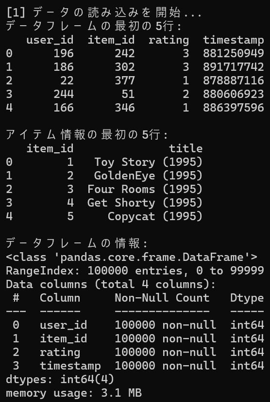
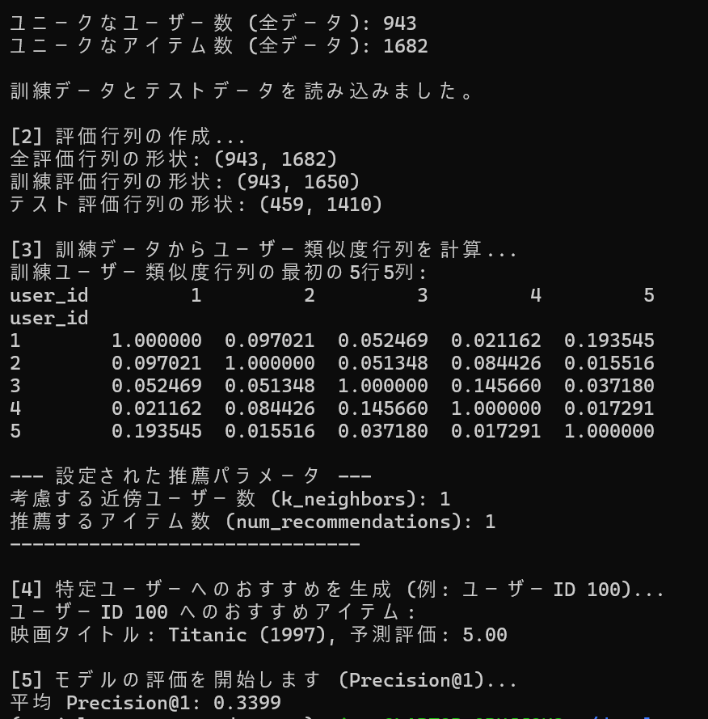

# Movielens Recommender by Cosine Similarity

## 概要
MovieLens 100Kデータセットを利用し、ユーザーベース協調フィルタリングとコサイン類似度を用いて、個々のユーザーにおすすめの映画を推薦するプロジェクトです。AIエンジニアを目指すにあたり、推薦システムの基本的なアルゴリズムの実装やモデル評価の経験を積むために、このプロジェクトを開発しました。

## 実行結果
  

## 主な機能
- ユーザーベース協調フィルタリングの実装: ユーザー間の類似度(コサイン類似度)に基づき、ターゲットユーザーがまだ評価していないアイテムの予測評価を算出し、推薦リストを生成。
- データセットの準備と前処理: MovieLens 100Kデータセットのu.data(評価データ)とu.item(アイテム情報)を読み込み、推薦アルゴリズムに適したユーザー-アイテム評価行列に変換。
- モデルの評価: 推薦システムの性能を客観的に評価するため、データセットを訓練データとテストデータに分割。テストデータでユーザーが実際に高評価したアイテムを正解とし、Precision@K(適合率)を計算。
- ハイパーパラメータチューニングの基礎: コマンドライン引数を通じて、推薦に利用する近傍ユーザー数と推薦するアイテム数を自由に調整し、モデルの性能変化を測定可能。
- 再利用性と関心の分離: 推薦ロジックのコア部分と、推薦結果をユーザー向けに整形する部分を関数として分離し、コードの重複を排除しつつ、可読性と保守性を高める。

## 使用技術
- 言語
  - Python
- ライブラリ
  - pandas: データフレームの操作、データの前処理、評価行列の作成に利用。
  - numpy: 数値計算、特にpandasの内部処理で利用。
  - scikit-learn: コサイン類似度計算に利用。
  - pathlib: ファイルパスの操作をよりオブジェクト指向的に、かつOS非依存に行うために利用。
  - argparse: コマンドライン引数を解析するために利用。
- 環境管理:
  - Conda: データサイエンスライブラリの依存関係を安定して管理するために使用。

## 導入・実行方法  
### 1. リポジトリをクローン  
```bash
git clone https://github.com/N-Ritsu/AIstudy.git  
cd AIstudy/movielens_recommender_by_cosine_similarity
```
### 2.Conda仮想環境の構築と有効化
```bash
conda create --name movielens_recommender_by_cosine_similarity_env python=3.10 -y
conda activate movielens_recommender_by_cosine_similarity_env
```
### 3. 必要なライブラリをインストール
```bash
pip install -r requirements.txt
```
### 4. MovieLens 100Kデータセットのダウンロード
以下のリンク先より、ml-100k フォルダを作業ディレクトリ内にダウンロードし、解凍してください。
リンク：https://grouplens.org/datasets/movielens/100k/

### 5. プログラムを実行
```bash
python movielens_recommender_by_cosine_similarity.py
```
なお、ハイパーパラメータや対象ユーザーを指定して実行する場合は例として以下のように実行してください。
```bash
python movielens_recommender_by_cosine_similarity.py --k_neighbors 5 --num_recommendations 10 --user_id 200
```

## 開発を通して
私はこのMovielens Recommender by Cosine Similarityの開発が、推薦システムアルゴリズムの実装経験となりました。  
ハイパーパラメータの調整にて、Precision@Kを最大値にするために試行錯誤したところ、結果としてk_neighbors = 1, num_recommendations = 1 という結果となりました。これは、最も類似しているユーザーの最も最適なアイテムのみを参照したからだと考えます。
しかしその結果、推薦するアイテムが少ないためシステムとして有用とは言いにくく、また類似ユーザー1人の情報の影響が強すぎることから不安定さも残るのではないかと考えられます。そのため、後ほど発展として、Recall@Kも参照するようにしたり、アルゴリズムの再考を試すことにします。