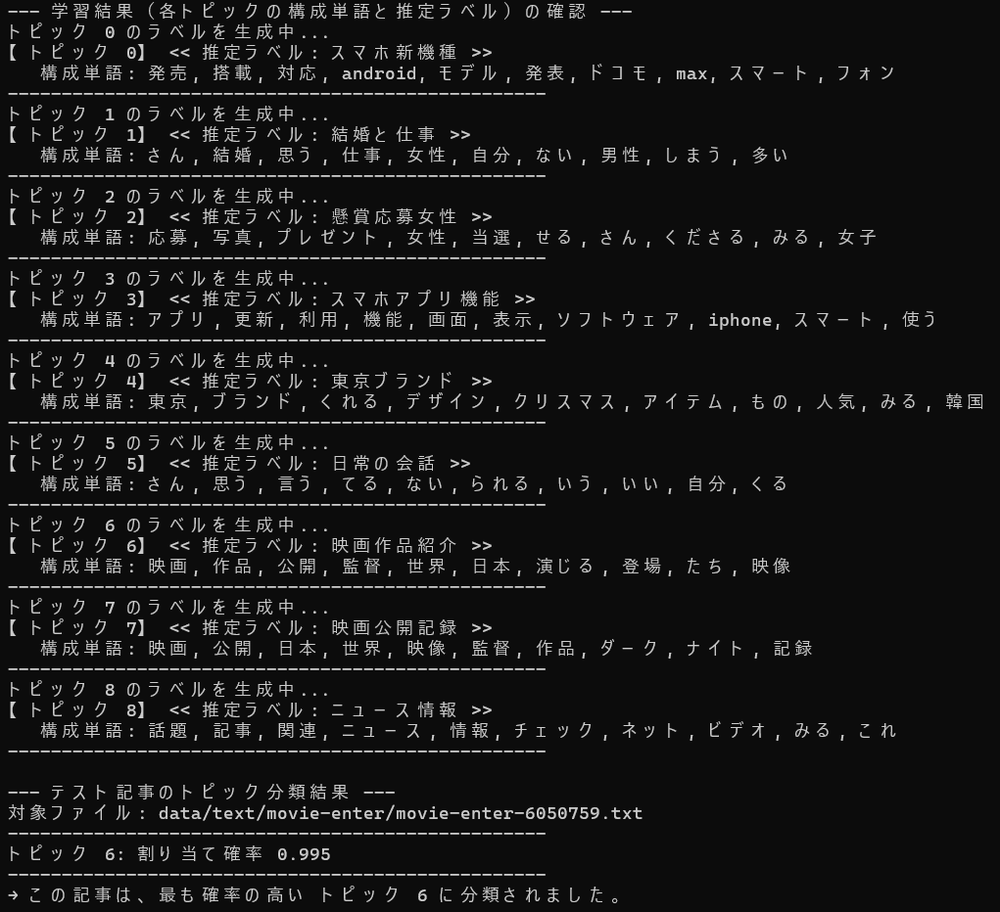

# News Topic Analyzer by LDA

## 概要
大量のニュース記事データを、トピックモデル(LDA)を用いて内容ごとに自動で分類するプログラムです。
AIエンジニアを目指すにあたり、自然言語処理(NLP)における教師なし学習、特にトピックモデリングの実装経験を積むために、このプロジェクトを開発しました。

## 実行結果


## 主な機能
- livedoorニュースコーパスをWebから自動でダウンロードし、展開
- Janomeライブラリを用いて、日本語テキストに対する形態素解析の前処理を実行
- gensimライブラリを用いて、LDA（Latent Dirichlet Allocation）モデルを構築し、文書データから潜在的なトピックを抽出
- 抽出した各トピックに対し、OpenAI APIを呼び出して最適なトピック名を自動で生成
- 個別のニュース記事が、どのトピックにどれくらいの確率で属するかを判定・表示

## 使用技術
・言語
  Python
・ライブラリ
  gensim
  janome
  openai
  requests

## 導入・実行方法
### 1. リポジトリをクローン
```bash
git clone https://github.com/N-Ritsu/AIstudy.git
cd AIstudy/news_topic_analyzer_by_lda
```
### 2. Conda仮想環境の構築と有効化
```bash
conda create --name news_topic_analyzer_by_lda_env python=3.10 -y
conda activate news_topic_analyzer_by_lda_env
```
### 3. 必要なライブラリをインストール
```bash
pip install -r requirements.txt
```
### 4.OpenAI APIキーを設定
本プログラムはトピック名の自動生成にOpenAI APIを使用します。実行する環境で、あらかじめ環境変数 OPENAI_API_KEY を設定してください。
Linux / macOS の場合:
```bash
export OPENAI_API_KEY="sk-..."
```
Windowsの場合:
```bash
set OPENAI_API_KEY="sk-..."
```
### 5. データセットのダウンロードと展開
下記のコマンドを実行して、分析対象となるlivedoorニュースコーパスをダウンロード・展開します。(初回実行時のみ必要です)
```bash
python download_data.py
```
### 6. プログラムを実行
```bash
python news_topic_analyzer_by_lda.py
```

## 開発を通して
私はこのNews Topic Analyzer by LDAの開発が、初めての教師なし学習による自然言語処理の経験となりました。  
統計的なアプローチであるLDAと意味理解に優れたLLMを組み合わせることで、ただの単語のリストから、人間が直感的に理解できるラベルへと変換できた点から、複数の異なる技術を組み合わせることによる新たな価値創造の可能性に魅力を感じました。  
また、データセットのファイルの拡張子が.tar.gzであったにも関わらず、実際にはgzip圧縮されていない普通の.tarファイルであるという珍しい問題に直面しました。この経験は、不測のエラーにも冷静に対処する良い経験になりました。