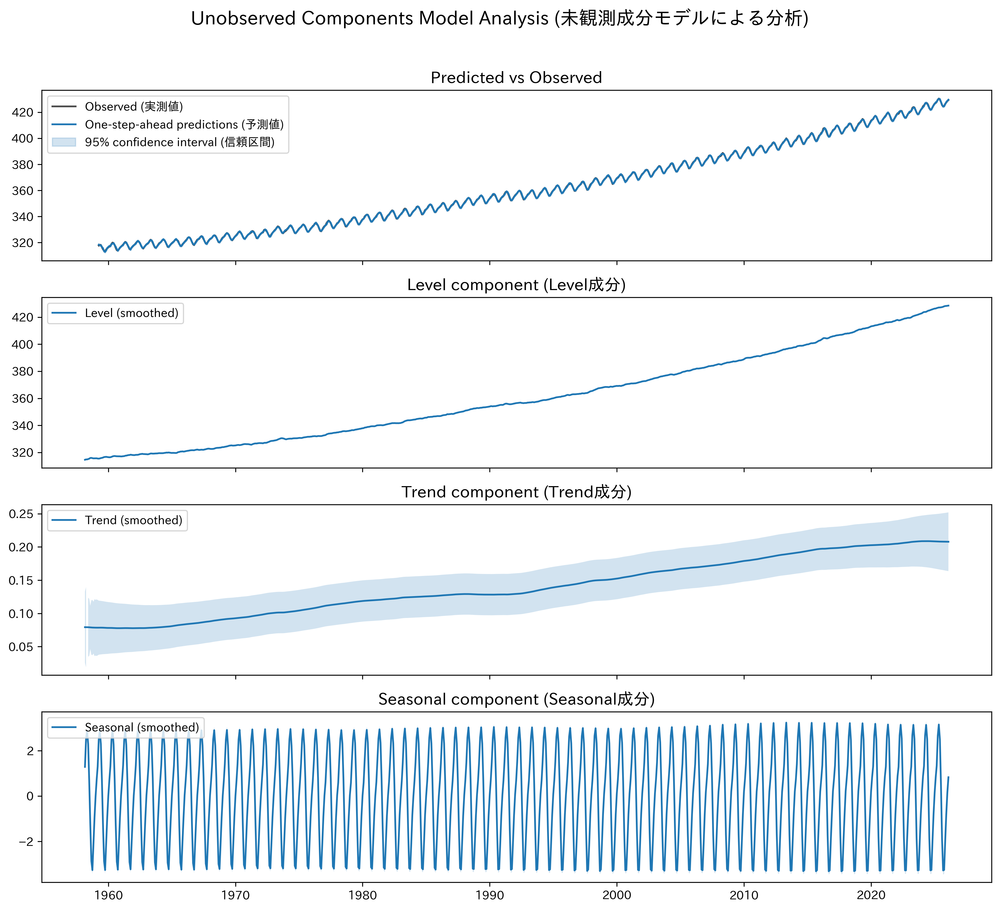
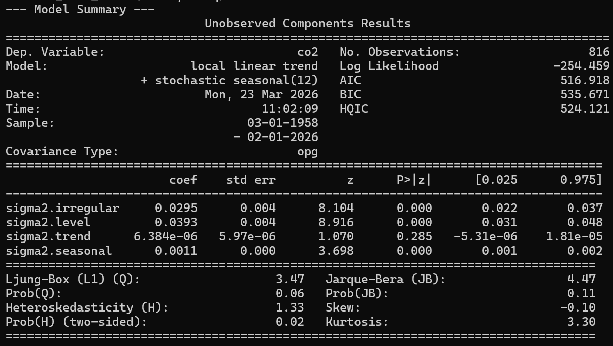

# PyUCM Analyzer

## 概要
状態空間モデル（構造時系列モデル、BSM）を用いて、最新のCO2濃度時系列データを分析し、その構造を解釈するプロジェクトです。  
AIエンジニアを目指すにあたり、ARIMAなどの予測精度を重視するモデルだけでなく、時系列データの変動要因をトレンド・季節性・不規則変動に分解することで、なぜそのような変動が起きているのかを解明する解釈性の高い構造時系列モデルへの理解を深めるために開発しました。

## 実行結果
分析結果(グラフ)


分析結果(精度)


## 主な機能
- アメリカ海洋大気庁（NOAA）の公式サイトから、最新の月次CO2濃度データを自動で取得
- statsmodelsライブラリを使用し、状態空間モデル（ローカル線形トレンド + 確率的季節性）を構築
- 観測された時系列データを、解釈可能な以下の成分に分解
  - レベル: データ全体の長期的な水準
  - トレンド: データの上昇・下降の勢い（傾き）
  - 季節性: 周期的な変動パターン
- 分解した各成分を、信頼区間と共にグラフとして可視化
- トレンド成分の経時的変化をシステムが自動で分析し、現在の傾向（増加/減少）や、40年前と比較したペースの加速/減速を、定量的な倍率と共に自然言語で出力
- 分析結果のグラフを画像ファイル（PNG）として自動で保存

## 使用技術
・言語
  Python
・ライブラリ
  pandas
  statsmodels
  matplotlib
  numpy

## 導入・実行方法
### 1. リポジトリをクローン
```bash
git clone https://github.com/N-Ritsu/AIstudy.git
cd AIstudy/pyucm_analyzer
```
### 2. Conda仮想環境の構築と有効化
```bash
conda create --name pyucm_analyzer_env python=3.10 -y
conda activate pyucm_analyzer_env
```
### 3. 必要なライブラリをインストール
```bash
pip install -r requirements.txt
```
### 4 . プログラムを実行
```bash
python pyucm_analyzer.py
```
実行すると、pyucm_analyzer_result_graph.pngが生成されます。

## 開発を通して
私はこのpyucm_analyzerの開発が、初めての構造時系列モデルを用いたシステム実装経験となりました。  
今回の出力結果より、CO2の変動については以下のことが分かりました。  
・CO2濃度は上昇し続けているだけでなく、その上昇速度自体が加速していること。  
・季節要因だけで毎年約6ppmの幅でCO2濃度が変動していること。  
・季節成分のノイズが統計的に有意ではなく、季節性のパターンが非常に安定していること。  
これらの結果は、構造時系列モデルを用いたからこそ見えるようになった要素であり、構造時系列モデルの解釈性の高さを深く理解できました。