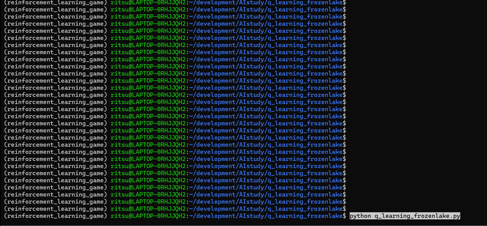
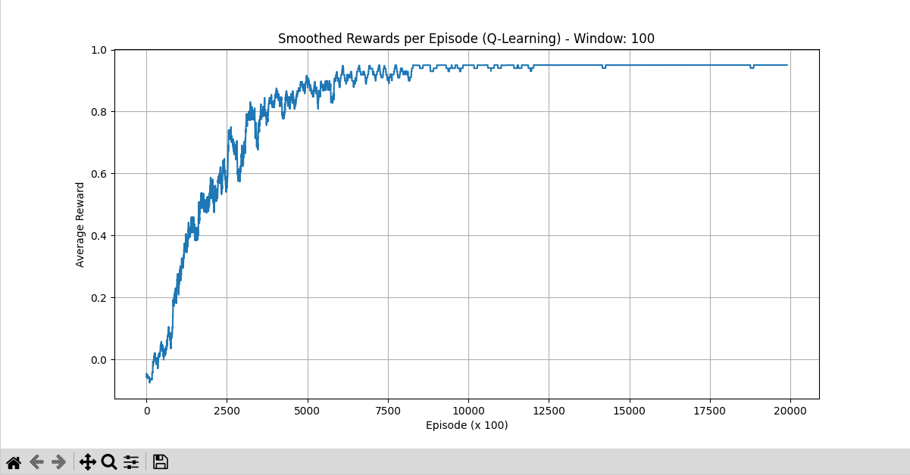

# Q-Learning FrozenLake

## 概要
Q学習アルゴリズムを用いて、gymnasiumライブラリのFrozenLake環境でエージェントを学習させ、効率的な経路探索能力を獲得させるプロジェクトです。AIエンジニアを目指すにあたり、強化学習の基本的なアルゴリズムであるQ学習の実装やハイパーパラメータチューニングの経験を積むために、このプロジェクトを開発しました。

## 実行結果


学習報酬の推移  


## 主な機能
- Q学習アルゴリズムの実装: 環境からの報酬に基づいてQテーブルを更新し、最適な行動方策を学習。
- 探索と活用のバランス: ε-greedy法を採用し、学習初期は探索を重視し、学習が進むにつれて活用を増やすことで、効率的な学習を実現。
- 動的な学習率調整: 直近の平均報酬を基準に学習率を動的に調整するロジックを導入し、学習の安定性と収束速度を向上。
- 最短経路探索の奨励: ステップごとに小さな負の報酬（ペナルティ）を与えることで、エージェントがゴールまでの最短経路を見つけるように学習を促す。
- 学習進捗の可視化: 学習の進捗を直感的に把握できるよう、各エピソードで得られた報酬の推移を移動平均で平滑化し、グラフとして表示。
- 学習済みAIの動作確認: 学習完了後、レンダリングモードで環境を再作成し、学習済みエージェントの動作を視覚的に評価可能。

## 使用技術
- 言語
  - Python
- ライブラリ
  - gymnasium: 強化学習環境「FrozenLake」の提供。
  - numpy: Qテーブルの操作、数値計算に利用。
  - matplotlib: 学習進捗（報酬グラフ）の可視化に利用。
  - collections.deque: 学習率調整のための直近報酬履歴を効率的に管理するために利用。
- 環境管理:
  - Conda: データサイエンスライブラリの依存関係を安定して管理するために使用。

## 導入・実行方法  
### 1. リポジトリをクローン  
```bash
git clone https://github.com/N-Ritsu/AIstudy.git  
cd AIstudy/q_learning_frozenlake
```
### 2.Conda仮想環境の構築と有効化
```bash
conda create --name q_learning_frozenlake_env python=3.10 -y
conda activate q_learning_frozenlake_env
```
### 3. 必要なライブラリをインストール
```bash
pip install -r requirements.txt
```
### 4. プログラムを実行
```bash
python q_learning_frozenlake.py
```

実行が完了すると、学習の進捗を示すグラフが表示され、その後、実際に学習済みAIがFrozenLakeを攻略する様子がアニメーションで表示されます。

## 開発を通して
私はこのQ-Learning FrozenLakeの開発が、初めてのQ学習アルゴリズムを使用した強化学習の経験となりました。  
この経験を通じて、ハイパーパラメータを試行錯誤し、最適な数値を模索する力をつけられたと感じています。  
しかし、このプロジェクトにて最も苦労したのは、直近の学習平均を元にした動的な学習率調整ロジックの実装についてです。これにより、固定の学習率での学習よりはるかに収束速度をあげつつ、安定した学習を実現することができました。