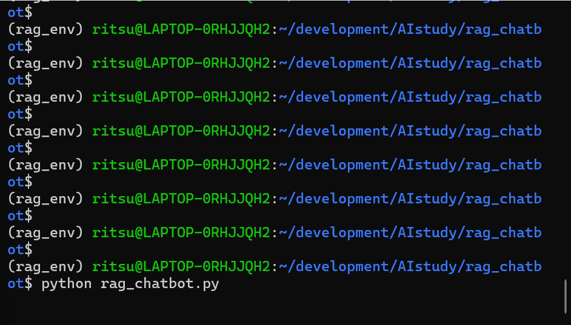

# RAG(Retrieval-Augmented Generation) Chatbot

## 概要  
LLMに外部のテキストファイルから知識を参照させ、その情報に基づいてユーザーの質問に回答するRAGシステムです。  
AIエンジニアを目指すにあたり、LLMを用いたシステム実装、ベクトルデータベースの構築、セマンティック検索、そしてプロンプトエンジニアリングを経験し、より高度で実践的なAIアプリケーションの開発経験を積むために、このプロジェクトを構築しました。

## 実行結果  
  
※上記gif画像では、動作確認の視認性の観点より、テキストファイルの情報のうち、関連性の高いと思われる1つの知識のみを参照しています。実際には3つ以上の知識を参照するようにすると精度が担保されるかと思います。

## 主な機能  
- 知識のベクトル化: knowledge.txtに記述された知識を、sentence-transformersを用いて高次元のベクトルに変換。
- ベクトル検索: faissライブラリを使用し、質問の意味に最も近い知識ベクトルを高速で検索。
- 検索拡張生成(RAG): 検索して見つけ出した関連知識をコンテキストとしてプロンプトに組み込み、GoogleのGemmaモデルに渡すことで、ハルシネーションを抑制し、事実に基づいた回答を生成。
- 柔軟な設計: knowledge.txtの中身を書き換えるだけで、AIを再トレーニングすることなく、チャットボットの専門分野を自由に変更可能。

## 使用技術  
- 言語: Python
- ライブラリ:
  - transformers(Hugging Face): LLM(google/gemma-2b-it)の実行
  - torch: transformersの計算バックエンド
  - sentence-transformers: テキストのセマンティックなベクトル化
  - faiss: 高速なベクトル類似度検索
  - numpy: 高度な数値計算と、多次元配列の操作に使用
  - typing: typingモジュールを活用し、コードの堅牢性と可読性を向上

## 導入・実行方法  
### 1. リポジトリをクローン  
```bash
git clone https://github.com/N-Ritsu/AIstudy.git  
cd AIstudy/rag_chatbot
```
### 2.Conda仮想環境の構築と有効化
```bash
conda create --name rag_env python=3.12 -y
conda activate rag_env
```
### 3. 必要なライブラリをインストール
```bash
pip install -r requirements.txt
```

### 4. Hugging Faceへのログイン  
Gemmaモデルをダウンロードするには、Hugging Faceへの認証が必要です。  
# 1. まず、モデルページで利用規約に同意してください: https://huggingface.co/google/gemma-2b-it  
# 2. ターミナルでログインコマンドを実行し、アクセストークンを入力  
huggingface-cli login  

### 5. 知識ファイルの準備  
knowledge.txtという名前のテキストファイルをこのディレクトリ内に作成し、AIに学習させたい知識を、段落ごとに空行を挟んで記述してください。  

### 6. プログラムを実行  
```bash
python rag_chatbot.py
```

## 開発を通して  
私はこのRAG Chatbotの開発が、初めてのLLMを用いたシステムの開発経験となりました。 
開発では、ベクトル化やベクトル検索などの、LLMならではの感覚的に理解が難しい箇所の実装に苦戦しました。  
しかし、最も苦労したのはシステムの実装そのものではなく、環境構築でした。  
私は最初、WSL環境下でpipとvenvを使った標準的な環境構築を試みましたが、Cythonのビルドエラー・MKLライブラリのリンク切れ・VSCodeとPython拡張機能の深刻な非互換性など、OSの低レベルな層にまで及ぶ数々の問題に直面しました。  
そこで私は、Robocopyによるファイル救出・WSLの完全な再インストール・そして最終的に、より堅牢なパッケージ管理システムであるCondaへの移行を行い、無事にエラーを解決することができました。  
この経験から、RAGの技術にとどまらず、複雑なエラーの原因究明とOSレベルでの環境の再構築を完遂する技術、そしてなにより、何度も様々なアプローチを用いて問題解決を図る粘り強さを手に入れることができました。  

以下に、環境構築時に発生した具体的な問題について、記録しておきます。  
1. ModuleNotFoundError  
- 課題: venvを用いて仮想環境を構築しようとしたところ、WSL環境下でpipやpythonの実行ファイルが正しく生成されないという、問題が発生  
- 原因: Ctrl+Cによる中断が、不完全な仮想環境を生み出していたこと、そして、WSL環境にプリインストールされていたPythonのバージョン(3.12)と、venvを作成するためのシステム部品(python3.12-venv)の間に、深刻な不整合があることを突き止めた。  
2. AttributeError: cython_sources  
- 課題: venvの問題を回避し、pipで直接ライブラリをインストールしようとしたところ、今度はnumpy・pandas・scipyといった科学計算ライブラリのビルドが、AttributeError: cython_sourcesとなった。
- 原因: Cコンパイラ(build-essential)、Pythonの開発ヘッダー(python3-dev)、そしてCythonそのものといった、OSレベルのビルドツールが不足していることが分かった。  
- 解決策: これらのツールをaptで一つずつ導入し、さらにpipやsetuptoolsを最新化した。  
3. libmkl_intel_lp64.so.2の失踪  
- 課題: ビルド地獄を回避する最終手段として、ビルド済みのパッケージを提供するCondaを導入。しかし、今度はimport torchの段階で、Intel MKLライブラリ(libmkl_intel_lp64.so.2)が見つからないというOSErrorに直面。  
- 原因: conda list -f mklコマンドを使った徹底的な調査の結果、conda installは成功したように見えていたにもかかわらず、肝心のライブラリファイルがディスク上に一切書き込まれていないという状態が発生していた。  
4. CPU推論への切り替え  
- 課題: すべての環境問題を乗り越えた後も、AIの推論速度が極端に遅い状態であった。  
- 原因: タスクマネージャーを駆使した詳細なパフォーマンス分析の結果、私のPCにはNVIDIA製の専用GPUが搭載されておらず、Mistral-7Bモデルを動かすにはVRAMが不足し、CPUとメインメモリで無理やり実行しようとして、深刻なスワッピングが発生していたことだと突き止めた。
- 解決策: PyTorchをcpuonlyモードで再インストールし、モデルをGemmaのような、より軽量なものに切り替えることで、最終的にプログラムを安定して動作させることに成功。