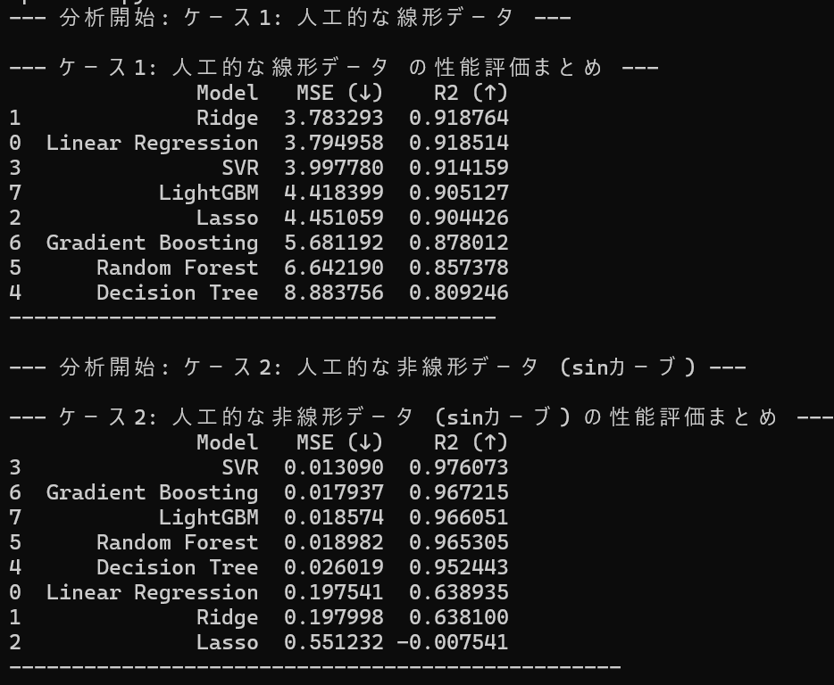
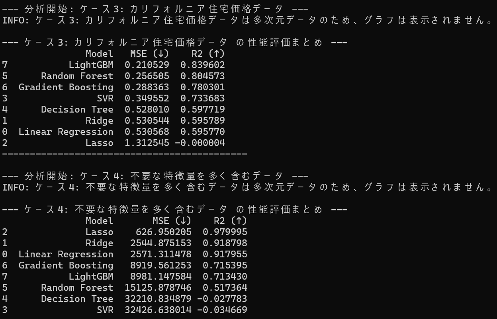
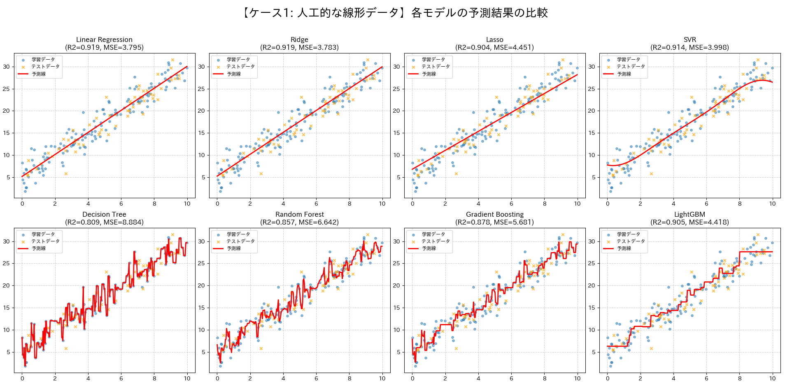
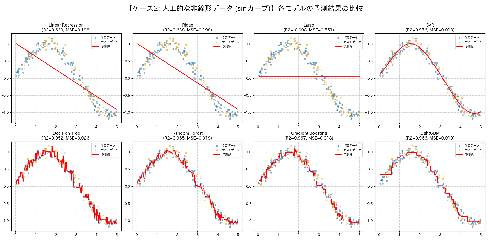

# Regression Model Comparison

## 概要
8つの主要な回帰モデル（線形回帰、Ridge、Lasso、決定木、SVR、ランダムフォレスト、勾配ブースティング、LightGBM）の性能と挙動を、特性の異なる4つのデータセットを用いて網羅的に比較・可視化するプロジェクトです。  
AIエンジニアを目指すにあたり、基礎的な回帰モデルが持つ理論的な強みと弱みが、実際のデータに対してどのように現れるかを深く理解することを目的として開発しました。  

## 実行結果
各モデルの精度比較(線形データ、非線形データ)


各モデルの精度比較(複雑なデータ、不要な特徴量を含むデータ)


予測線の可視化図(線形データ)


予測線の可視化図(非線形データ)


## 主な機能
- 8つの主要な回帰モデルの学習と予測を実装
- モデルの特性を炙り出すため、以下の4つのデータセットを自動生成・取得
  - 単純な線形関係を持つデータ
  - 非線形（サインカーブ）関係を持つデータ
  - 実世界の複雑なデータ（カリフォルニア住宅価格）
  - 不要な特徴量を多く含む高次元データ
- 各モデルの予測線を2x4のグリッド形式で一括描画し、視覚的な比較を容易化
- 各モデルの性能をMSEおよびR2で定量的に評価し、表形式で出力
- モデルに応じてデータスケーリングを自動で適用
- japanize-matplotlibを使用し、グラフの日本語表示に対応

## 使用技術
・言語
  Python
・ライブラリ
  pandas
  scikit-learn
  lightgbm
  matplotlib
  numpy
  japanize-matplotlib

## 導入・実行方法
### 1. リポジトリをクローン
```bash
git clone https://github.com/N-Ritsu/AIstudy.git
cd AIstudy/regression_model_comparison
```
### 2. Conda仮想環境の構築と有効化
```bash
conda create --name regression_model_comparison_env python=3.10 -y
conda activate regression_model_comparison_env
```
### 3. 必要なライブラリをインストール
```bash
pip install -r requirements.txt
```
### 4 . プログラムを実行
```bash
python regression_model_comparison.py
```

## 開発を通して
私はこのClassification Model Analyzerの開発が、初めて複数の回帰モデルを多角的に比較・評価した経験となりました。  
この開発を通して学んだ各モデルの特徴をまとめておきます。  

Linear Regression: 一番シンプルで、解釈が非常に分かりやすいが、複雑なデータに対し精度が低い。特徴量と予測結果の間に直線的な関係がありそうなデータに対し特効的に有効なイメージ。  
Ridge: Linear Regressionに対し、特定の特徴量に過剰に引っ張られないようにすることで、重要度の高い特徴量に対する過学習を防ぐモデル。Linear Regressionで過学習が疑われる際の代替案の１つ。  
Lasso: Linear Regressionに対し、不必要な特徴量を削減することで、余計なノイズをなくし、重要度の低い特徴量に対する過学習を防ぐモデル。Linear Regressionで過学習が疑われる際の代替案の１つ。  
Decision Tree: 過学習しやすいが、なぜそのような予測になったのかを、人間が理解しやすいルールベースでしっかりと確認できるのが強み。"なぜその結果になったのか"をしっかり追いたい場合に有効なイメージ。  
SVR: 非線形な分割が可能という特徴がある。複雑なデータに対しても汎用的に精度が高い。しかし、計算コストが多くなりがちで、解釈性が低い。ある程度計算量が多くても、そして解釈性が不要な場面で、滑らかな予測を行いたい場合に最適なイメージ。  
Random Forest: Decision Treeの過学習リスクを大幅に抑制する代わりに、解釈性が下がったモデル。精度と解釈の分かりやすさともに全体的にバランスがいいイメージ。  
Gradient Boosting: 非常に高い予測精度を誇る。その代わり、ハイパーパラメータの調整が複雑・過学習しやすい・解釈性が低いという欠点がある。  
LightGBM: Gradient Boostingを、高速・省メモリにした改良モデル。基本的にGradient Boostingの上位互換と考えて良いが、データサイズが小さい場合の過学習リスクが高いため、その場合はRandom ForestやGradient Boostingの方が適する場合がある。とにかく高い精度が求められる場合に最適なイメージ。  

このプログラムを通して、基礎的な回帰モデルそれぞれの特性について深く理解することができました。