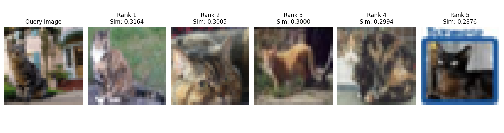

# Similar Image Search by CNN

## 概要  
事前学習済みのCNN（畳み込みニューラルネットワーク）モデルを用いて、指定した画像と似ている画像をデータセットの中から検索するプログラムです。
AIエンジニアを目指すにあたり、学習済み深層学習モデルを応用したシステム開発の経験を積むために、このプロジェクトを開発しました。

## 実行結果  
  


## 主な機能  
- torchvisionライブラリを用いて、CIFAR-10データセットから特定のクラスの画像を自動で抽出し、検索対象のデータセットとして準備
- 事前学習済みの画像認識モデル（VGG16）を特徴抽出器として利用
- データセット内の全画像から特徴量ベクトルを抽出し、後から高速に読み込めるようにファイル（.pkl）に保存
- 検索したい画像と、データセット内の全画像との特徴量ベクトルのコサイン類似度を計算
- 類似度の高い順に、検索元画像と検索結果の画像を並べて可視化

## 使用技術  
・言語  
  Python  
・ライブラリ   
  torch
  torchvision
  scikit-learn
  numpy
  Pillow
  matplotlib
  tqdm

## 導入・実行方法  
### 1. リポジトリをクローン  
```bash
git clone https://github.com/N-Ritsu/AIstudy.git  
cd AIstudy/similar_image_search_by_cnn
```
### 2. 必要なライブラリをインストール
```bash
pip install -r requirements.txt
```
### 3. 検索対象の画像データを準備
```bash
python download_data.py
```
実行すると、dataset_imagesフォルダが作成され、猫の画像が500枚保存されます
### 4. 全画像の特徴量を抽出し、ファイルに保存
```bash
python extract_features.py
```
実行すると、features.pklファイルが作成されます
### 5. メインプログラムを実行
```bash
python similar_image_search_by_cnn.py
```

## 開発を通して  
私はこの類似画像検索エンジンの開発が、初めて事前学習済みモデルを応用したシステム開発の経験となりました。  
このプログラムでの工夫点は、全画像の特徴量ベクトルをバイナリファイルとして保存することで、実行の度に特徴量の抽出を行う手間を省き、高速化を実現した点です。  
download_data.pyやextract_features.pyのように、目的に合わせてプログラムファイルを分割する利点について改めて理解を深めることができました。