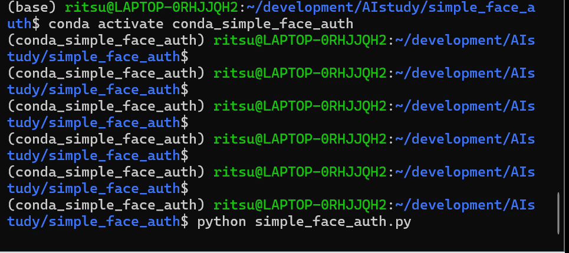

# Simple Face Auth

## 概要  
基準となる顔写真と複数の未知の顔写真に対しそれぞれ顔認証を行い、未知の顔写真に写る人物が既知の人物と一致するかAIによって判定するプログラムです。  
AIエンジニアを目指すにあたり、AIによる画像認識の経験を積むために、このプロジェクトを開発しました。

## 実行結果  


## 主な機能  
- 基準となる顔写真と複数の未知の顔写真に対しそれぞれ顔認識を行い、AIが顔の特徴を数値化した顔特徴量ベクトルを抽出
- 与えられたパスの写真が見つからない、または顔が認識できなかった場合、エラーメッセージを表示
- 未知の顔写真に写る人物が既知の顔写真に写る人物と同一人物かどうか、2つの顔特徴量ベクトルのユークリッド距離を計算し、類似度を判定
- 判定の閾値を調整するTOLERANCEパラメータを搭載

## 使用技術  
- 言語  
  - Python  
- ライブラリ   
  - face-recognition: 顔検出と顔認証のためのAPIを提供するライブラリ
  - dlib: face-recognitionの内部で利用されている、機械学習とコンピュータビジョンのための強力なC++ツールキット。
  - NumPy: 顔特徴量(128次元ベクトル)などの数値データを効率的に扱うために使用。
  - Pillow(PIL Fork): 画像ファイルの読み込みと操作のために暗黙的に利用。
- 環境管理:
  Conda: 依存関係の複雑な科学技術計算ライブラリを安定して管理するために使用。

## 導入・実行方法  
### 1. リポジトリをクローン  
```bash
git clone https://github.com/N-Ritsu/AIstudy.git  
cd AIstudy/simple_face_auth
```
### 2.Conda仮想環境の構築と有効化
```bash
conda create --name face_auth_env python=3.10 -y
conda activate face_auth_env
```
### 3. 必要なライブラリをインストール
```bash
conda install -c conda-forge dlib
pip install -r requirements.txt
```
### 4. 画像ファイルの準備
プロジェクトのルートディレクトリに、以下の3つの画像ファイルを作成してください。
- known_face.jpg: 認証の基準となる人物の顔写真
- same_face.jpg: known_face.jpgと同一人物の、別の顔写真
- different_face.jpg: known_face.jpgとは別人の顔写真
### 5. プログラムを実行
```bash
python simple_face_auth.py
```

## 開発を通して  
私はこのSimple Face Authの開発が、初めての顔認証プログラム作成経験となりました。  
開発で最も苦労したのは、リファクタリングによる関数の一般化です。  
最初は既存の顔写真の認識と、比較対象の顔写真の認識を、それぞれ別々の関数で行っていました。これをどのように一般化して一つの関数に落とし込むことができるかといった点で頭を悩ませました。  
結果として、とてもシンプルな形で一般化することに成功し、コードを圧倒的に短く、可読性を高めることができました。  
この開発を通して、pythonでの画像認識と顔識別についての理解を深めるだけでなく、関数の一般化というリファクタリングスキルを向上させることができました。
