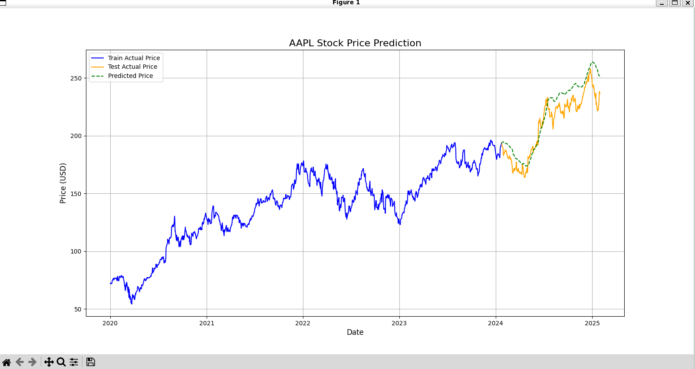

# Stock Price Predictor

## 概要
PyTorchで構築したLSTMモデルを用いて、過去の株価データから未来の株価を予測するプログラムです。
AIエンジニアを目指すにあたり、リカレントニューラルネットワーク（RNN）を用いた時系列データ分析の実装経験を積むために、このプロジェクトを開発しました。

## 実行結果



## 主な機能
- yfinanceライブラリを使用し、指定した銘柄・期間の株価データを自動で取得
- 取得した株価データを0から1の範囲に正規化し、LSTMモデルが学習可能なシーケンスデータに前処理
- PyTorchを用いて、LSTM層と全結合層からなる株価予測モデルを構築
- 構築したモデルに訓練データを学習させ、未知のテストデータ期間に対する株価を予測
- 訓練期間の実績値、テスト期間の実績値、そしてモデルによる予測値を一つのグラフにまとめてプロットし、結果を可視化

## 使用技術
・言語
  Python
・ライブラリ
  yfinance
  pandas
  numpy
  scikit-learn
  torch (PyTorch)
  matplotlib

## 導入・実行方法
### 1. リポジトリをクローン
```bash
git clone https://github.com/N-Ritsu/AIstudy.git
cd AIstudy/stock_price_predictor
```
### 2. Conda仮想環境の構築と有効化
```bash
conda create --name stock_price_predictor_env python=3.10 -y
conda activate stock_price_predictor_env
```
### 3. 必要なライブラリをインストール
```bash
pip install -r requirements.txt
```
### 4 . プログラムを実行
```bash
python stock_price_predictor.py
```

## 開発を通して
私はこのStock Price Predictorの開発が、初めてのLSTMを用いた本格的な時系列データ予測の経験となりました。  
LSTM層と全結合層の違いに着目しながら実装することで、LSTM層の時間軸を考慮できる特徴と、全結合層の最終的な予測値を導き出せる特徴で、互いを補完している関係に面白さを感じました。  
また実装を進めていく上で、プロトタイプの出力にて、最後の実測値と最初の予測値の間に大きな差が生まれることでグラフが途切れたようになってしまう問題があり、バイアスをかけることで修正することを試みました。その際、データフレームの整合性がとれなくなることによるエラーが何度も発生し、データの形状を都度確認する堅牢なコードへとリファクタリングを重ねることで解決することができました。