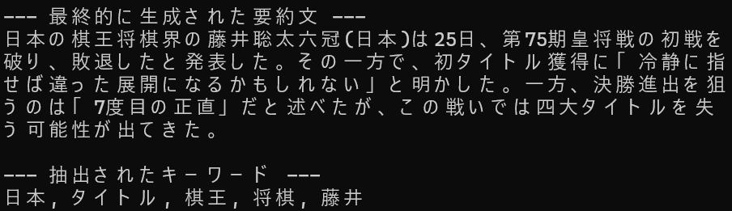

# T5 Text Summarizer

## 概要
Transformerベースの言語モデルであるT5を用いて、日本語の長文テキストを要約し、また、その中から話題のキーワードを抽出するコマンドラインツールです。  
AIエンジニアを目指すにあたり、生成系NLPタスクの経験を積むために、このプロジェクトを開発しました。

## 実行結果
要約前の文章：  
将棋の藤井聡太六冠（23）が、2026年2月に行われた第75期王将戦七番勝負で大きな試練に直面している。第4局（和歌山市）で挑戦者の永瀬拓矢九段（33）に敗れ、対戦成績を1勝3敗とされ、タイトル失冠の危機に追い込まれた。これにより、藤井六冠は史上初の「八冠独占」からわずか数カ月で一つのタイトルを失う可能性が出てきた。  
王将戦は1月から始まり、第1局（東京都渋谷区）では藤井が優勢を保ちながらも終盤で逆転を許し、永瀬に先勝を許した。第2局（大阪府高槻市）では藤井が意地を見せ、終盤の激しい攻防を制して1勝1敗のタイに持ち込んだ。しかし第3局（東京都渋谷区）で再び永瀬が勝利し、3勝1敗とリードを広げた。第4局では、永瀬が後手番ながら角換わり腰掛け銀の戦型を選択。藤井は序盤から積極的に仕掛けたが、中盤の受けが一瞬乱れ、永瀬の鋭い反撃に耐えきれず132手で投了した。  
藤井六冠はこの敗戦について、対局後の取材で「自分のミスが多かった。もっと冷静に指せば違った展開になったかもしれない」と振り返った。一方、永瀬九段は「藤井さん相手にここまでリードできるとは思っていなかった。まだ油断はできないが、次の一局に全力を尽くす」とコメント。永瀬にとっては、これが悲願の初タイトル獲得への大きなチャンスとなっている。永瀬はこれまで藤井に対してタイトル戦で何度も苦杯を舐めてきたが、今回は「7度目の正直」となる可能性が高い。  
背景として、藤井六冠は2025年に史上最年少で八冠を達成し、将棋界に新たな時代を切り開いた。しかし、2026年に入ってからは多忙な日程が影響しているとの指摘もある。NHK杯選手権では準決勝で豊島将之九段を破り決勝進出を決めたものの、棋王戦では増田康宏八段との対局が控えており、同時並行のタイトル防衛戦が体力的・精神的に負担となっている。関係者によると、藤井は「睡眠時間が短くなっている」「集中力が少し落ちている瞬間がある」と漏らしており、ファンの間でも「忙しすぎるのでは」と心配の声が上がっている。

要約後の文章：  


## 主な機能
- 入力されたテキストのトークン数に応じて、生成する要約文の最小長・最大長を動的に調整
- モデルの入力長制限を超える長文テキストに対し、以下の二段階アプローチで対応
  - テキストを適切な長さのチャンクに自動で分割し、それぞれを部分要約
  - 生成された部分要約をすべて結合し、それをさらに要約することで、文脈を維持した全体要約を生成
- 生成された要約文から、形態素解析を用いて重要と思われるキーワードを抽出

## 使用技術
・言語
  Python
・ライブラリ
  transformers
  torch
  sentencepiece
  tiktoken
  janome

## 導入・実行方法
### 1. リポジトリをクローン
```bash
git clone https://github.com/N-Ritsu/AIstudy.git
cd AIstudy/t5_text_summarizer
```
### 2. Conda仮想環境の構築と有効化
```bash
conda create --name t5_text_summarizer_env python=3.10 -y
conda activate t5_text_summarizer_env
```
### 3. 必要なライブラリをインストール
```bash
pip install -r requirements.txt
```
### 4. 要約する文章を準備
要約したい内容を記述したテキストファイルを用意してください。  
なお、デフォルトでは要約後のトークン長が最大150トークンにしていされているため、長すぎるテキストファイルは要約に適しません。場合によってプログラム内の定数を変更しながらお使いください。
### 5. プログラムを実行
```bash
python t5_text_summarizer.py [要約したいテキストファイルのパス]
```

## 開発を通して
私はこのT5 Text Summarizerの開発が、初めての生成系NLPタスクへの挑戦となりました。  
このプログラムを進めるにあたり、元の文章がが長い場合に、要約文の日本語がおかしくなったり、要点をうまくつかめなくなる課題に直面しました。  
この課題を解決するため、元の文章の長さを参照することで生成する要約文の長さを動的に変動させるシステムや、長い文章を一定トークンごとに分割して細かく要約を行ってから再度結合して全体の要約を行うという２段階要約アルゴリズムを考案し、実装いたしました。  
結果、AIモデルが持つ制約をソフトウェア側の工夫で乗り越えることができ、入力の内容に合わせて柔軟に対応するシステムの開発経験を積むことができました。