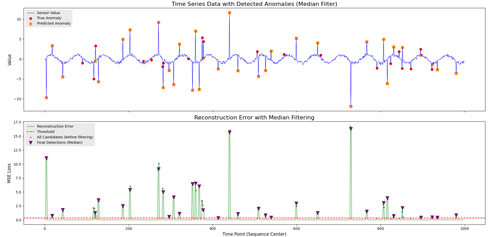

# Time Series Anomaly Detector by Autoencoder

## 概要  
PyTorchで構築したLSTM Autoencoderモデルを用いて、時系列データの中から異常を検出するプログラムです。
AIエンジニアを目指すにあたり、教師なし学習による時系列データでの異常検知システムの開発経験を積むために、このプロジェクトを開発しました。

## 実行結果  
  


## 主な機能  
- sin波をベースに、正常データと異常データが含まれる擬似的な時系列データを自動生成
- 時系列データの特徴を学習するためのLSTM AutoencoderモデルをPyTorchで構築
- 正常な時系列データのみを用いてモデルを学習させる
- 学習済みモデルを用いて全データの再構成誤差を計算
- スライディングウィンドウによって発生する重複検知を抑制するため、検出された異常候補点をグループ化し、その中央点のみを最終的な異常として特定する後処理を実装
- 元の時系列データと検出された異常、および再構成誤差のグラフを並べて可視化

## 使用技術  
・言語  
  Python  
・ライブラリ   
  torch
  numpy
  pandas
  scikit-learn
  matplotlib

## 導入・実行方法  
### 1. リポジトリをクローン  
```bash
git clone https://github.com/N-Ritsu/AIstudy.git  
cd AIstudy/time_series_anomaly_detector_by_autoencoder
```
### 2. 必要なライブラリをインストール
```bash
pip install -r requirements.txt
```
### 3. データセットを作成
```bash
python create_dataset.py
```
実行すると、time_series_data.csvファイルが保存されます
### 4. モデルの学習を実行
```bash
python run_anomaly_detection_training.py
```
実行すると、以下の4フォルダが保存されます
- lstm_autoencoder.pth
- X_test.pt
- scaler.npy
- original_data.npy
### 5. メインプログラムを実行
```bash
python time_series_anomaly_detector_by_autoencoder.py
```

## 開発を通して  
私はこのTime Series Anomaly Detector by Autoencoderの開発が、初めての時系列データに対する異常検知プログラムの開発経験となりました。  
このシステムを開発する中で、異常なデータ付近の正常なデータをAIが異常値判定してしまうという問題に直面しました。  
最初はこの問題に対しハイパーパラメータやウィンドウサイズの調整により解決を図りましたが、改善はされたものの根本的な解決には至りませんでした。  
そこで、検出された候補点をグループ化し、その中央点のみを異常値として処理するという独自の後処理を加えることで、システムの精度を大幅に向上させることができました。