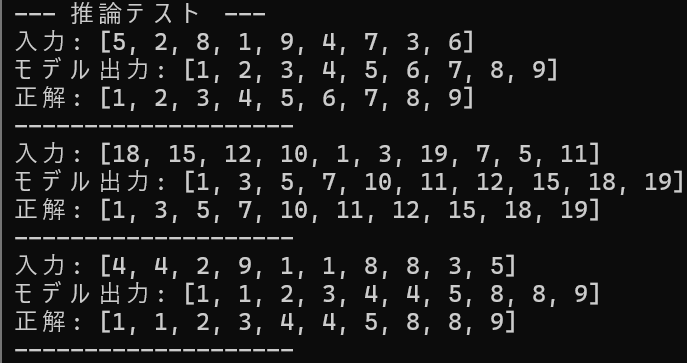

# Transformer from Scratch

## 概要
論文"Attention Is All You Need"で提案されたTransformerのコアアーキテクチャを、PyTorchを用いてゼロから実装するプロジェクトです。　　
AIに強いアプリケーションエンジニアを目指すにあたり、現代のLLMや生成AIの基盤となっているTransformerの内部動作、特にSelf-Attention機構をコードレベルで深く理解するために開発しました。

## 実行結果


## 主な機能
- Transformerのコアコンポーネント実装:
  - PositionalEncoding: sin/cos関数を用いた、トークンの位置情報を注入する機構。
  - TokenEmbedding: 入力トークンを固定長のベクトルに変換する埋め込み層。
  - PyTorch標準のnn.Transformerを内部で利用しつつ、その前後処理を自作することで、Encoder-Decoder全体のデータフローを構築。
- マスクの実装:
  - Padding Mask: バッチ処理時に、長さの異なるシーケンスのパディング部分を計算から除外。
  - Subsequent Mask: Decoderが未来の情報をカンニングするのを防ぎ、自己回帰的な生成を実現。
- 系列変換タスク:
  - ランダムな数列とそのソート済み解答のペアを動的に生成するカスタムDatasetを実装。
- 学習と推論:
  - CPU環境でも現実的な時間で完了する、小規模なモデル（Tiny Transformer）の学習パイプラインを構築。
  - 学習済みのモデルを用い、未知の数列を1トークンずつ自己回帰的に生成・ソートする推論ロジックを実装。

## 使用技術
・言語
  Python
・ライブラリ
  PyTorch
  NumPy
  Matplotlib

## 導入・実行方法
### 1. リポジトリをクローン
```bash
git clone https://github.com/N-Ritsu/AIstudy.git
cd AIstudy/transformer_from_scratch
```
### 2. Conda仮想環境の構築と有効化
```bash
conda create --name transformer_from_scratch_env python=3.10 -y
conda activate transformer_from_scratch_env
```
### 3. 必要なライブラリをインストール
```bash
pip install -r requirements.txt
```
### 4 . プログラムを実行
```bash
python transformer_sorter.py
```

## 開発を通して
私はこのtransformer_sorterの開発が、初めてTransformerアーキテクチャの内部動作を実装する経験となりました。  
Subsequent Maskを始めとして、開発当初はなかなか直感的な理解が難しい部分も、実際に実装してみる経験から、しっかりと理解することができました。  
AI技術において頻繁に利用されるTransformerについて、内部動作にまで踏み込んで理解した経験は、以降のAI技術理解を促進させてくれると考えています。