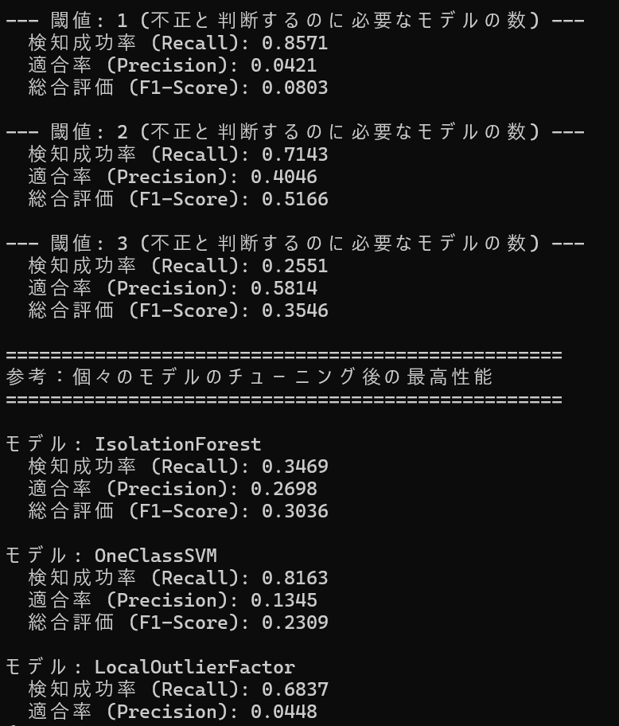
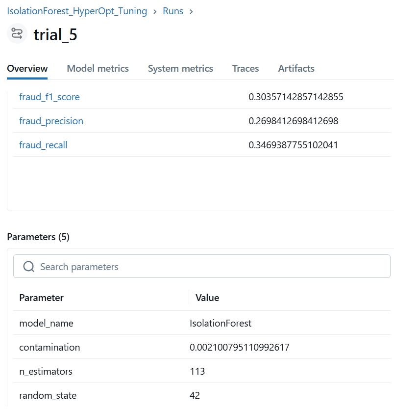
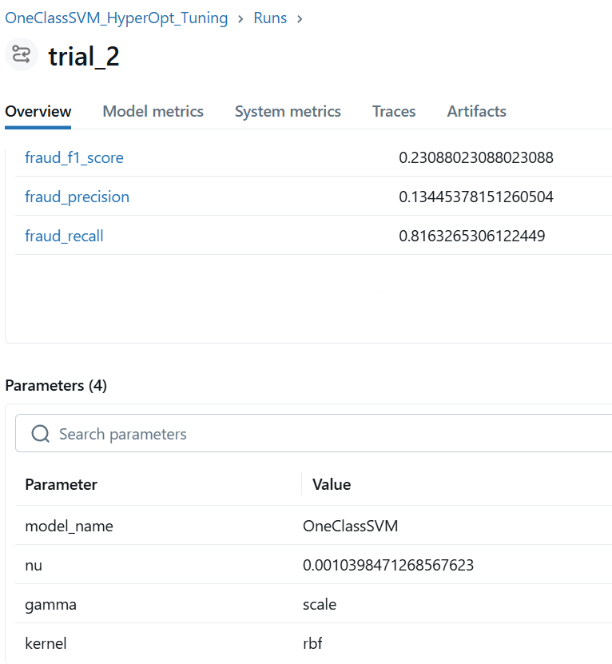
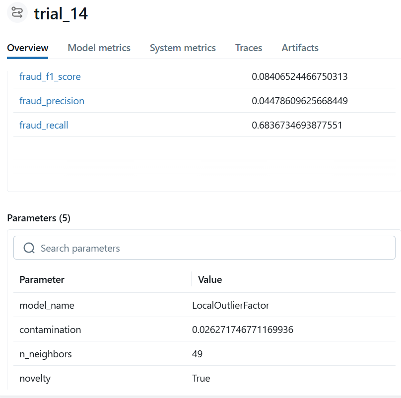

# Unsupervised Anomaly Detection Tracker with MLflow

## 概要
Kaggleで公開されているクレジットカード取引データセットを用いて、不正利用取引を検知する機械学習プログラムです。  
3つの異なる教師なし学習モデル（Isolation Forest, OneClassSVM, Local Outlier Factor）に対し、それぞれハイパーパラメータチューニングを行いMLflowで管理、そして3つのモデルの評価を組み合わせるアンサンブル手法により高い精度を誇ります。  
AIエンジニアを目指すにあたり、単一のモデルを構築するだけでなく、再現性のある実験管理(MLflow)、複数モデルの客観的評価、そして自動ハイパーパラメータチューニング(Optuna)といった、より実践的なMLOps（機械学習基盤）のスキルセットを習得するために、このプロジェクトを開発しました。

## 実行結果
最終的な結果一覧


各モデルの最適パラメータ(MLflow)
・IsolationForest HyperOpt Tuning


・OneClassSVM HyperOpt Tuning


・LocalOutlierFactor HyperOpt Tuning


## 主な機能
- IsolationForest, OneClassSVM, LocalOutlierFactorという3つの異なる教師なし異常検知アルゴリズムを実装し、性能を比較。
- MLflowを導入し、パラメータ、メトリクス、モデルを含む全ての実験を体系的に管理・追跡。
- Optunaによる自動ハイパーパラメータチューニングを実装し、各モデルの性能を最大化。
- チューニングで見つけた最適なハイパーパラメータをjsonファイルに保存し、再利用する仕組みを構築。
- 乱数シードを固定し、実験の再現性を担保。
- 個々のモデルの性能だけでなく、アンサンブル学習による精度向上を検証。
- アンサンブルの閾値を変更することで、ビジネス目的に応じた複数の戦略を同時に評価。

## 使用技術
・言語
  Python
・ライブラリ
  pandas
  scikit-learn
  mlflow
  optuna
  numpy

## 導入・実行方法
### 1. リポジトリをクローン
```bash
git clone https://github.com/N-Ritsu/AIstudy.git
cd AIstudy/unsupervised_anomaly_detection_tracker_with_mlflow
```
### 2. データセットのダウンロードと配置
本プログラムは、Kaggleで公開されているCredit Card Fraud Detectionデータセットを使用します。  
こちらのリンク(https://www.kaggle.com/datasets/mlg-ulb/creditcardfraud)から、Kaggleのデータセットページにアクセスしてください。  
Kaggleにログイン（または新規登録）し、Downloadボタンをクリックしてデータセットをダウンロードします。  
ダウンロードしたZIPファイルを解凍し、中に入っているcreditcard.csvファイルを、このプロジェクトのディレクトリに配置してください。
### 3. Conda仮想環境の構築と有効化
```bash
conda create --name unsupervised_anomaly_detection_tracker_with_mlflow_env python=3.10 -y
conda activate unsupervised_anomaly_detection_tracker_with_mlflow_env
```
### 4. 必要なライブラリをインストール
```bash
pip install -r requirements.txt
```
### 5. プログラムを実行
ステップ１: モデルの自動チューニング
```bash
python unsupervised_anomaly_detection_tracker_with_mlflow.py
```
実行が完了すると、最適なハイパーパラメータがoptimal_hyperparameters.jsonに保存されます。

ステップ２: 最終評価とアンサンブル分析の実行
```bash
python ensemble_analyzer.py
```

ステップ３: MLflow UIで実験結果を確認
```bash
mlflow ui
```
実行後、ブラウザで http://127.0.0.1:5000 にアクセスすると、実験管理ダッシュボードを閲覧できます。

## 開発を通して
私はこのUnsupervised Anomaly Detection Tracker with MLflowの開発が、初めてのMLflowによる実験管理経験となりました。  
このプログラムでは、あらゆるパラメータチューニングを自動化・管理することを目標とし、手動で一切パラメータをいじることなく、最適なハイパーパラメータを探索するシステムを実装しました。  
また、３種のモデルを独立して比較評価するだけでなく、それらを組み合わせて評価するアンサンブル戦略を組み込むことで、精度を劇的に向上させることができました。  
そしてアンサンブル戦略にて、閾値の設定によって以下のような違いが生まれました。  
・閾値１: 検知成功率最高(0.8571)  
・閾値２: 総合評価最高(0.5166)  
・閾値３: 適合率最高(0.5814)  
これにより、ビジネス上の目的に対し閾値を変更することの重要性を改めて理解することができました。