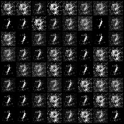
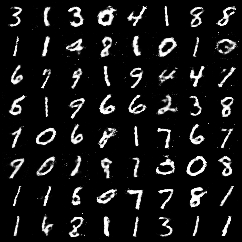

# Vanilla GAN Painter

## 概要
PyTorchを用いてGAN（敵対的生成ネットワーク）を構築し、手書き数字データセットを学習させることで、新たな手書き数字画像を生成するプログラムです。  
AIエンジニアを目指すにあたりGANの仕組み、特に敵対的学習のプロセスをコードレベルで深く理解するために、このプロジェクトを開発しました。

## 実行結果
学習前


学習後


## 主な機能
- torchvisionライブラリを使用し、MNISTデータセットを自動で取得
- 取得した画像を-1から1の範囲に正規化し、GANの学習に適した形に前処理
- PyTorchを用いて、全結合層からなるGeneratorとDiscriminatorを構築
- GeneratorとDiscriminatorを交互に訓練する敵対的学習ループを実装し、モデルを学習
- 学習済みモデルの重みをバイナリファイルとして保存し、再実行時には学習をスキップして読み込む機能を実装
- 学習の進捗を画像として保存し、生成品質が向上していく過程を可視化
- 最終的に生成された画像をmatplotlibで表示

## 使用技術
・言語
  Python
・ライブラリ
  torch
  torchvision
  matplotlib
  numpy

## 導入・実行方法
### 1. リポジトリをクローン
```bash
git clone https://github.com/N-Ritsu/AIstudy.git
cd AIstudy/vanilla_gan_painter
```
### 2. Conda仮想環境の構築と有効化
```bash
conda create --name vanilla_gan_painter_env python=3.10 -y
conda activate vanilla_gan_painter_env
```
### 3. 必要なライブラリをインストール
```bash
pip install -r requirements.txt
```
### 4 . プログラムを実行
```bash
python vanilla_gan_painter.py
```
初回の実行ではMNISTデータセットのダウンロードとモデルの学習が実行され、完了すると、各エポックごとの生成画像が格納されたimagesフォルダと、バイナリファイルであるgenerator.pthとdiscriminator.pthが生成されます。2回目以降はこれらのファイルを読み込むため、学習はスキップされます。  

## 開発を通して
私はこのvanilla_gan_painterの開発が、初めてのGANの実装経験となりました。  
互いに競い合いながら性能を高めていく敵対的学習のコンセプトに非常に面白さを感じ、その仕組みを深く理解することができました。  
以前VAEで画像生成を実装した際にくらべ、比較的くっきりとした画像を生成しようとする振る舞いに、アプローチの違いによる性質の変化を実感しました。一方で、GANの学習は非常に不安定になりやすいと感じ、GeneratorとDiscriminatorの学習のバランスを取るためのハイパーパラメータの調整がVAE作成に比べ難しかったです。GANならではのハイパーパラメータの重要性を知ることができました。