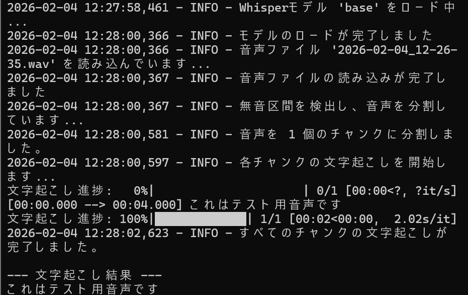

# Whisper CLI Transcriber

## 概要
OpenAIの音声認識モデルWhisperを利用して、音声ファイルから文字起こしを行うコマンドラインツールです。
AIエンジニアを目指すにあたり、音声という非構造化データを扱う実践的な経験を積むために、このプロジェクトを開発しました。

## 実行結果
以下は、コマンドラインでプログラムを実行し、コンソール上に文字起こしの結果を出力した際の実行ログです。


## 主な機能
- 高精度な文字起こし: OpenAIのWhisperモデルを利用し、様々な形式の音声ファイル（mp3, wav, mp4など）から高精度な日本語の文字起こしを実現
- 長尺ファイルの自動分割: pydubライブラリを用いて音声ファイル内の無音区間を自動で検出し、ファイルを小さなチャンクに分割。これにより、メモリ消費を抑えつつ長時間のファイル処理に対応
- コマンドラインインターフェース: argparseを利用して、ターミナルから入力ファイルや出力形式、使用モデルなどを柔軟に指定可能
- 多様な出力形式: 文字起こし結果を、シンプルなテキストファイル、または動画の字幕として利用可能なタイムスタンプ付きのSRTファイル形式で出力可能
- 進捗の可視化: tqdmライブラリにより、複数のチャンクを処理する際の進捗をプログレスバーで表示

## 使用技術
・言語
  Python
・ライブラリ
  openai-whisper
  pydub
  tqdm
・その他
  ffmpeg

## 導入・実行方法
### 1. リポジトリをクローン
```bash
git clone https://github.com/N-Ritsu/AIstudy.git
cd AIstudy/whisper_cli_transcriber
```
### 2. Conda仮想環境の構築と有効化
```bash
conda create --name whisper_cli_transcriber_env python=3.10 -y
conda activate whisper_cli_transcriber_env
```
### 3. 必要なライブラリとツールをインストール
```bash
pip install -r requirements.txt
```
WSL2/Ubuntuの場合:
pydubが内部で音声ファイルを処理するために、ffmpegが必要です
```bash
sudo apt update
sudo apt install ffmpeg
```
### 4 . プログラムを実行
基本的な使い方（結果をコンソールに出力）
```bash
python whisper_cli_transcriber.py path/to/your/audio.wav
```
結果をテキストファイルに保存
```bash
python whisper_cli_transcriber.py path/to/your/audio.mp3 -o result.txt
```
タイムスタンプ付きのSRTファイルとして保存
```bash
python whisper_cli_transcriber.py path/to/your/audio.mp3 --srt -o subtitle.srt
```

## 開発を通して
私は大学の研究にて、音声の文字起こしの経験はありましたが、このWhisper CLI Transcriberの開発を通して、改めて音声という非構造化データを扱うことについて理解を深めることができました。  
中でも特に工夫を凝らした点は、長時間の音声ファイルをそのままモデルに入力するとメモリ負荷が高くなるという問題に対し、pydubライブラリを用いて無音区間で音声を自動分割するパイプラインを実装することで課題解決を図った点です。  
また、様々なオプションを追加することで、よりシステムとして使いやすく実装した点も、ユーザーインターフェースを考慮するうえで良い経験となりました。