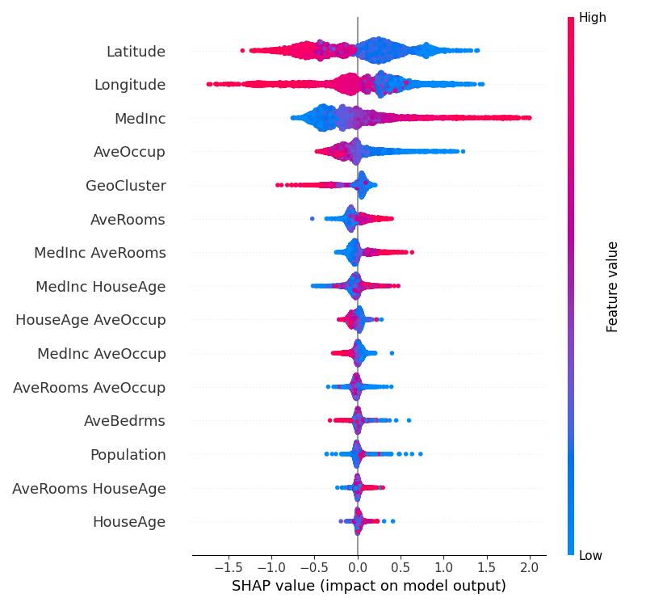
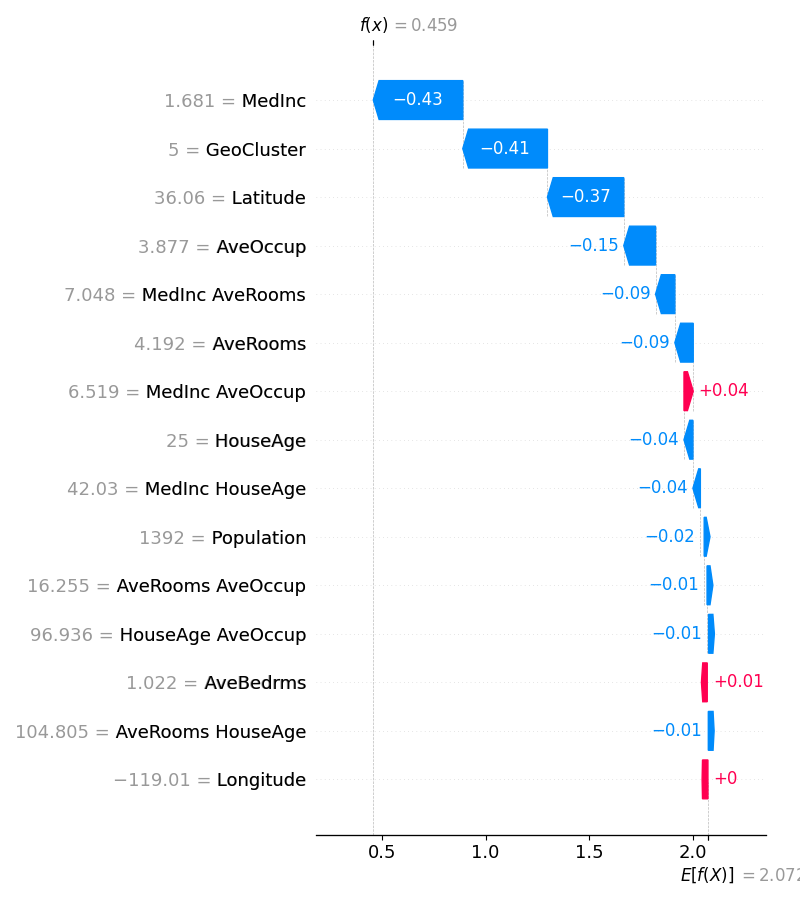

# XAI for Housing Regression

## 概要
XGBoostを用いてカリフォルニアの住宅価格を予測し、その予測根拠をSHAPライブラリを用いて可視化するプロジェクトです。  
AIエンジニアを目指すにあたり、AIの判断プロセスを解明するXAI、モデルの精度を能動的に向上させる特徴量エンジニアリング、そしてモデル評価の信頼性を担保する交差検証といった、一連の実践的な機械学習開発プロセスを深く理解するために開発しました。

## 実行結果
サマリープロット


ウォーターフォールプロット


## 主な機能
- scikit-learnライブラリを使用し、カリフォルニア住宅価格データセットを自動で取得
- K-Meansクラスタリングを用い、緯度・経度から「地域クラスター」という新たな地理的特徴量を作成
- PolynomialFeaturesを用い、複数の特徴量を組み合わせた「交互作用特徴量」を作成し、相乗効果をモデル化
- XGBoostモデルを構築し、作成した特徴量を用いて住宅価格の予測モデルを学習
- KFold交差検証を実装し、データ分割の偶然性を排除した信頼性の高いモデル性能評価を実施
- SHAPライブラリを用いて、学習済みモデルの予測根拠を分析
  - モデル全体の傾向を示すサマリープロットを生成
  - 個別データに対する予測の要因を可視化するウォーターフォールプロットを生成
- 分析結果を画像ファイルとして自動で保存

## 使用技術
・言語
  Python
・ライブラリ
  pandas
  scikit-learn
  xgboost
  shap
  matplotlib
  numpy

## 導入・実行方法
### 1. リポジトリをクローン
```bash
git clone https://github.com/N-Ritsu/AIstudy.git
cd AIstudy/xai_for_housing_regression
```
### 2. Conda仮想環境の構築と有効化
```bash
conda create --name xai_for_housing_regression_env python=3.10 -y
conda activate xai_for_housing_regression_env
```
### 3. 必要なライブラリをインストール
```bash
pip install -r requirements.txt
```
### 4 . プログラムを実行
```bash
python xai_for_housing_regression.py
```
実行すると、summary_plot.pngとwaterfall_plot.pngが生成されます。

## 開発を通して
私はこのxai_for_housing_regressionの開発が、初めてのXAIを用いたシステムの実装経験となりました。  
開発を進めていく上で、緯度や経度が、価格に大きな影響をもたらしていることに気づいたのですが、緯度や経度が独立して価格に影響を与えているのではなく、価格の高い地域が一か所に集中していることからなる副次的な結果であるのではないかと考えました。  
そこで、K-Meansによる地理的特徴量の作成を行うことで、単純な緯度や経度ではなく地域によって価格を予想するシステムを構築することができました。