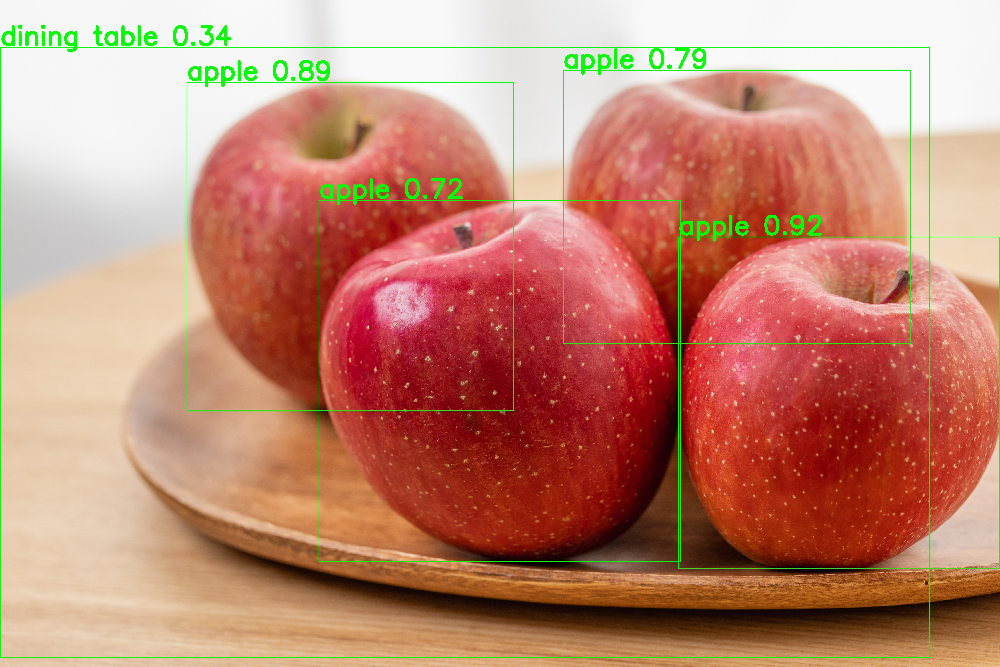

# YOLOv8 Object Detector

## 概要
事前学習済みの物体検出モデル"YOLOv8"とOpenCVを利用して、静止画や動画ファイルからリアルタイムに近い形で物体を検出・追跡するプログラムです。  
AIエンジニアを目指すにあたり、コンピュータビジョンの根幹技術である物体検出およびオブジェクトトラッキングの実装経験を積むために、このプロジェクトを開発しました。

## 実行結果
静止画の物体検出


動画のオブジェクトトラッキング
※こちらのGIFは実行結果の動画を変換して作成したものです


## 主な機能
- 静止画の物体検出: 指定された画像ファイル内の物体を検出し、その位置をバウンディングボックスで、種類をクラス名で可視化。
- 動画のオブジェクトトラッキング: 指定された動画ファイル内の物体をフレーム間で追跡し、個々の物体にユニークな追跡IDを付与して可視化。
- 信頼度フィルタリング: AIの推論結果における信頼度に基づき、設定した閾値に満たない不確かな検出結果を除外することで、アウトプットの精度を向上。

## 使用技術
・言語
  Python
・ライブラリ
  ultralytics (YOLOv8)
  opencv-python

## 導入・実行方法
### 1. リポジトリをクローン
```bash
git clone https://github.com/N-Ritsu/AIstudy.git
cd AIstudy/yolov8_object_detector
```
### 2. Conda仮想環境の構築と有効化
```bash
conda create --name yolov8_object_detector_env python=3.10 -y
conda activate yolov8_object_detector_env
```
### 3. 必要なライブラリをインストール
```bash
pip install -r requirements.txt
```
### 4 . プログラムを実行
- 静止画を検出する場合
detect_static.pyのimage_pathを対象の画像ファイルパスに書き換えて実行してください。
```bash
python yolov8_object_detector_image.py
```
- 動画を追跡する場合
track_video.pyのinput_video_pathを対象の動画ファイルパスに書き換えて実行してください。
```bash
python track_video.py
```

## 開発を通して
私はこのYOLOv8 Object Detectorの開発が、初めての物体検出とトラッキングの経験となりました。  
当初は静止画の検出のみでしたが、機能を拡張して動画のトラッキングを実装する過程で、状態を維持しながら連続データを処理するという、時系列データ分析にも通じる考え方を学びました。  
また信頼度について、どこまでを許容し、どこまでを描画しないように設定するべきかという、精度と検出力のトレードオフ関係について微調整するのが難しかったです。今回は誤検出を避けることを優先し、信頼度スコア0.55未満を描画しないように設定することで、正しい検出のみを描画することに成功しました。